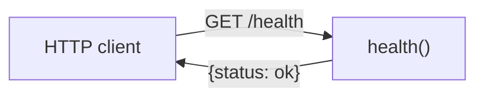

_Last updated: 2026-10-05 — T1: health check unchanged; money.py has no runtime data flow._

# Data flow

The only data that moves is the health check. The frontend renders a static heading and does not send or receive API data. Nothing is stored.

## What moves

1. **In.** An HTTP `GET /health` with no body, query, or auth. In tests this comes from `TestClient` in `backend/tests/test_health.py`.
2. **Transform.** `health()` in `backend/app/main.py` builds the dict `{"status": "ok"}`. FastAPI serializes it as JSON and returns HTTP 200.
3. **Out.** The response body `{"status": "ok"}` goes back to the caller.
4. **Not stored.** No database write or read.

`frontend/src/App.tsx` is outside this flow. `frontend/src/smoke.test.ts` asserts `true === true` and does not touch the API or the component.

`backend/app/domain/money.py` is unused at runtime. `validate_order`, `compute_split`, and `compute_fee` run only when `backend/tests/test_money.py` calls them. No endpoint accepts `LineInput` or returns `OrderSplit`.
