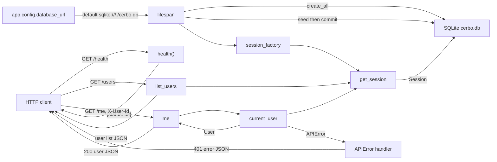

_Last updated: 2026-10-05 — T3: startup seed commits catalog rows; /users and /me read users._

# Data flow

Startup writes the seed into SQLite and keeps a session factory. After that, HTTP data moves on three routes: an unauthenticated health check, an unauthenticated user list, and `GET /me`, which resolves `X-User-Id` to one user or a 401. The frontend renders a static heading and does not send or receive API data.

## Startup

`create_app` stores `database_url` on `app.state` before the lifespan runs. The default is `sqlite:///./cerbo.db` from `app.config`.

1. `make_engine` opens that URL and attaches the SQLite connect and begin listeners.
2. `init_db` calls `Base.metadata.create_all`, which creates `users`, `products`, `provider_products`, `orders`, `order_lines`, and `ledger_entries` when they are missing.
3. `seed(session)` stages rows that are not already present, matched by `users.name`, `products.sku`, and the `provider_products` pair. The lifespan then `commit`s. That writes Dr. Maya Patel (provider), Jane Doe and Sam Lee (patients), Cerbo Admin (admin), products MAG-GLY, D3-K2, OMEGA3, and PROBIO50, and Dr. Patel's four enabled `provider_products` at suggested prices. `orders`, `order_lines`, and `ledger_entries` stay empty.
4. `make_session_factory` is saved on `app.state.session_factory`.
5. Shutdown calls `engine.dispose()`.

## GET /health

1. **In.** `GET /health` with no body, query, or auth.
2. **Transform.** `health()` builds `{"status": "ok"}`. FastAPI serializes it as JSON and returns HTTP 200.
3. **Out.** `{"status": "ok"}` goes back to the caller.
4. **Storage.** This route does not open a session and does not read or write SQLite.

## GET /users

1. **In.** `GET /users` with no auth header.
2. **Read.** `get_session` opens a `Session` and closes it without committing. `list_users` runs `select(User).order_by(User.id)`.
3. **Out.** HTTP 200 and a JSON list of `{id, name, role}` for every row. After the startup seed, that list is the four users above, ordered by `id`.

## GET /me

1. **In.** `GET /me` and header `X-User-Id`.
2. **Resolve.** `current_user` uses the same request session. A missing header, a value that is blank after trimming, a value that is not an ASCII digit string, or an integer above the signed 64-bit maximum raises `APIError` before any lookup. Any other value is loaded with `session.get(User, id)`. An unknown id raises the same error.
3. **Out, success.** `me` returns the `User`. FastAPI serializes `{id, name, role}` and returns HTTP 200.
4. **Out, failure.** The app's `APIError` handler returns HTTP 401 and `{"error": {"code": "UNAUTHENTICATED", "message": "Missing or unknown user", "line_index": null}}`.
5. **Storage.** The route only reads `users`. The session closes with no commit.

The branch detail is in `flows/auth.md`.

## Present in code, idle at runtime

`backend/app/domain/money.py` has no caller on these paths. `validate_order`, `compute_split`, and `compute_fee` run when `backend/tests/test_money.py` calls them.

`require_role` depends on `current_user` and raises 403 `FORBIDDEN` "Wrong role" when the user's role is outside the allowed set. No production route depends on it. `require_order_access(order, user)` returns `None` when the user is that order's provider or patient, and raises 404 `NOT_FOUND` "Not found" otherwise. No production route calls it. The `APIError` handler would serialize either failure as `{"error": {"code", "message", "line_index": null}}`.
