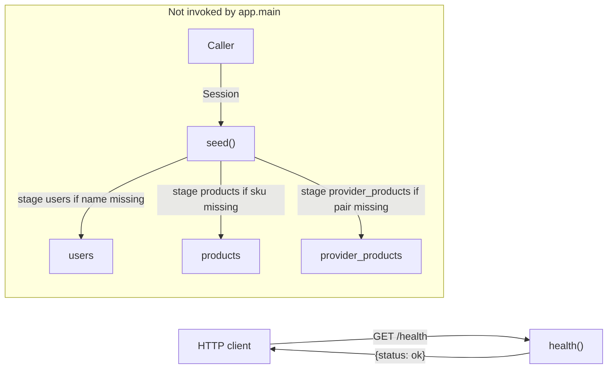

_Last updated: 2026-10-05 — T2: health check is still the only HTTP flow; seed runs only when a caller invokes it._

# Data flow

The only HTTP data that moves is the health check. The frontend renders a static heading and does not send or receive API data. `seed()` can stage catalog rows, and nothing in the running app calls it.

## What moves

1. **In.** An HTTP `GET /health` with no body, query, or auth. In tests this comes from `TestClient` in `backend/tests/test_health.py`.
2. **Transform.** `health()` in `backend/app/main.py` builds the dict `{"status": "ok"}`. FastAPI serializes it as JSON and returns HTTP 200.
3. **Out.** The response body `{"status": "ok"}` goes back to the caller.
4. **Not stored.** The health check does not read or write the database.

`frontend/src/App.tsx` is outside this flow. `frontend/src/smoke.test.ts` asserts `true === true` and does not touch the API or the component.

`backend/app/domain/money.py` is unused at runtime. `validate_order`, `compute_split`, and `compute_fee` run only when `backend/tests/test_money.py` calls them. The database layer does not call them. No endpoint accepts `LineInput` or returns `OrderSplit`.

## Seed, only when a caller invokes it

`seed(session)` in `backend/app/seed.py` looks up rows already on the `Session` and stages inserts that are missing:

- `users` — matched by `name` (Dr. Maya Patel, Jane Doe, Sam Lee, Cerbo Admin).
- `products` — matched by `sku` (MAG-GLY, D3-K2, OMEGA3, PROBIO50).
- `provider_products` — Dr. Maya Patel paired with each of those products, `enabled=1`, `default_price_cents` set to the product's suggested price.

`seed()` does not commit. The caller decides whether those staged rows are persisted. It does not create tables and does not write `orders`, `order_lines`, or `ledger_entries`. `app.main` does not import or call `seed`. Tables appear only when a caller runs `init_db` (`create_all`); the running app does not.
