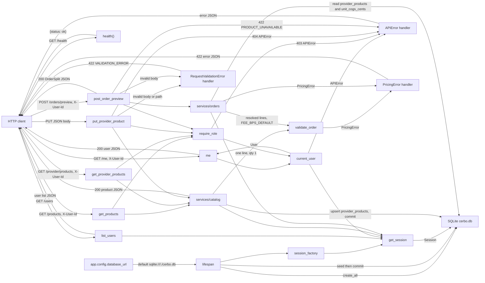

_Last updated: 2026-10-05 — T5: order preview reads enabled links and unit COGS, then returns a split with no write._

# Data flow

Startup writes the seed into SQLite and keeps a session factory. After that, HTTP data moves on the health check, the user list, `GET /me`, the catalog routes, and `POST /orders/preview`. Catalog reads return product JSON. A provider price update validates one line, then writes that provider's `provider_products` row. An order preview reads `provider_products` and `products.unit_cogs_cents`, validates the resolved lines, and returns an `OrderSplit`. It does not write. The frontend renders a static heading and does not send or receive API data.

## Startup

`create_app` stores `database_url` on `app.state` before the lifespan runs. The default is `sqlite:///./cerbo.db` from `app.config`.

1. `make_engine` opens that URL and attaches the SQLite connect and begin listeners.
2. `init_db` calls `Base.metadata.create_all`, which creates `users`, `products`, `provider_products`, `orders`, `order_lines`, and `ledger_entries` when they are missing.
3. `seed(session)` stages rows that are not already present, matched by `users.name`, `products.sku`, and the `provider_products` pair. The lifespan then `commit`s. That writes Dr. Maya Patel (provider), Jane Doe and Sam Lee (patients), Cerbo Admin (admin), products MAG-GLY, D3-K2, OMEGA3, and PROBIO50, and Dr. Patel's four enabled `provider_products` at suggested prices. `orders`, `order_lines`, and `ledger_entries` stay empty.
4. `make_session_factory` is saved on `app.state.session_factory`.
5. Shutdown calls `engine.dispose()`.

## GET /health

1. **In.** `GET /health` with no body, query, or auth.
2. **Transform.** `health()` builds `{"status": "ok"}`. FastAPI serializes it as JSON and returns HTTP 200.
3. **Out.** `{"status": "ok"}` goes back to the caller.
4. **Storage.** This route does not open a session and does not read or write SQLite.

## GET /users

1. **In.** `GET /users` with no auth header.
2. **Read.** `get_session` opens a `Session` and closes it without committing. `list_users` runs `select(User).order_by(User.id)`.
3. **Out.** HTTP 200 and a JSON list of `{id, name, role}` for every row. After the startup seed, that list is the four users above, ordered by `id`.

## GET /me

1. **In.** `GET /me` and header `X-User-Id`.
2. **Resolve.** `current_user` uses the same request session. A missing header, a value that is blank after trimming, a value that is not an ASCII digit string, or an integer above the signed 64-bit maximum raises `APIError` before any lookup. Any other value is loaded with `session.get(User, id)`. An unknown id raises the same error.
3. **Out, success.** `me` returns the `User`. FastAPI serializes `{id, name, role}` and returns HTTP 200.
4. **Out, failure.** The app's `APIError` handler returns HTTP 401 and `{"error": {"code": "UNAUTHENTICATED", "message": "Missing or unknown user", "line_index": null}}`.
5. **Storage.** The route only reads `users`. The session closes with no commit.

The branch detail is in `flows/auth.md`.

## GET /products

1. **In.** `GET /products` and header `X-User-Id`.
2. **Auth.** `require_role("provider", "admin")` resolves `current_user` first. Failure is 401 `UNAUTHENTICATED` or 403 `FORBIDDEN` "Wrong role". A patient is forbidden. A provider and an admin are allowed.
3. **Read.** `list_products` runs `select(Product).order_by(Product.id)`. The session closes with no commit.
4. **Out.** HTTP 200 and a JSON list of `{id, sku, name, unit_cogs_cents, suggested_price_cents, stock_qty}`. After the startup seed, that is MAG-GLY, D3-K2, OMEGA3, and PROBIO50, ordered by `id`.

## GET /provider/products

1. **In.** `GET /provider/products` and header `X-User-Id`.
2. **Auth.** `require_role("provider")`. An admin or a patient is 403 `FORBIDDEN`. A missing or unknown user is 401 `UNAUTHENTICATED`.
3. **Read.** `list_provider_products` joins `provider_products` to `products` where `provider_id` is the caller, ordered by `products.id`. `stock_qty` and `unit_cogs_cents` come from `products`. Rows for other providers are not included. A provider with no links gets `[]`.
4. **Out.** HTTP 200 and a JSON list of `{product_id, sku, name, enabled, default_price_cents, unit_cogs_cents, stock_qty}`. `enabled` is JSON `true` when the stored integer is `1`.
5. **Storage.** Read only. Stock is not writable on this route.

The read and update branches are in `flows/provider-products.md`.

## PUT /provider/products/{product_id}

1. **In.** `PUT /provider/products/{product_id}`, header `X-User-Id`, and a JSON body `{"enabled", "default_price_cents"}`.
2. **Auth.** `require_role("provider")`, same 401 and 403 outcomes as the provider list.
3. **Request validation.** `product_id` must be an integer. `ProviderProductUpdate` is strict: `enabled` is a JSON boolean and `default_price_cents` is a JSON integer. A bad path or body raises `RequestValidationError` before `update_provider_product`. The handler returns HTTP 422 and `{"error": {"code": "VALIDATION_ERROR", "message": "Invalid request", "line_index": null}}`. Nothing is written.
4. **Product lookup.** `update_provider_product` loads `products` by id. `UnknownProduct` is mapped in the route to `APIError` 404 `NOT_FOUND` "Not found". No price check and no write.
5. **Price check.** `validate_order` receives one `LineInput`: that `product_id`, `qty` 1, `unit_price_cents` equal to `default_price_cents`, and `unit_cogs_cents` from the product, plus `FEE_BPS_DEFAULT`. `PricingError` is not caught in the route. The app handler returns HTTP 422 and `{"error": {"code": <pricing code>, "message": <detail>, "line_index": <line index or null>}}`. Nothing is written.
6. **Write.** For this provider and product only, insert a `provider_products` row or update the existing one. The stored fields are `enabled` (`1` or `0`) and `default_price_cents`. `session.commit()` runs in the service. `products.stock_qty` and every other provider's rows stay as they were.
7. **Out.** HTTP 200 and one object with the same fields as a provider-list row. `stock_qty` is still the `products` value.

## POST /orders/preview

1. **In.** `POST /orders/preview`, header `X-User-Id`, and a JSON body `{"lines": [{"product_id", "qty", "unit_price_cents"}, ...]}`.
2. **Auth.** `require_role("provider")`. An admin or a patient is 403 `FORBIDDEN`. A missing or unknown user is 401 `UNAUTHENTICATED`.
3. **Request validation.** `PreviewRequest` and `PreviewLineRequest` are strict. Each line's `product_id`, `qty`, and `unit_price_cents` must be JSON integers. A bad body raises `RequestValidationError` before `preview_order`. The handler returns HTTP 422 and `{"error": {"code": "VALIDATION_ERROR", "message": "Invalid request", "line_index": null}}`. Nothing is written.
4. **Resolve, in order.** `preview_order` does not commit and does not insert, update, or delete. For each line, a `product_id` outside `1..9223372036854775807` is unavailable and is not queried. Otherwise it loads `provider_products` for `(provider_id, product_id)`. A missing row or `enabled` other than `1` is unavailable and does not read `products`. An enabled row then loads `products` and copies `unit_cogs_cents`. A missing product is unavailable. `stock_qty` is not read. `orders`, `order_lines`, and `ledger_entries` are not read or written.
5. **Unavailable line.** If any earlier line already resolved, `validate_order` runs on that prefix at `FEE_BPS_DEFAULT` before the unavailable error. A `PricingError` from the prefix is the response: HTTP 422, `code` is the pricing code, `message` is `detail`, and `line_index` is that error's line index. If the prefix is valid, or there is no prefix, the route maps `ProductUnavailable` to `APIError` 422 `PRODUCT_UNAVAILABLE`, message "Product is not available for this provider.", and `line_index` of the unavailable line. Nothing is written.
6. **Every line resolved.** `validate_order` runs on the full list at `FEE_BPS_DEFAULT`. An empty `lines` array takes this path and raises `EMPTY_ORDER`. Any other `PricingError` uses the same 422 handler as the prefix. Nothing is written.
7. **Out.** HTTP 200 and the `OrderSplit` fields: `lines` of `{product_id, qty, unit_price_cents, unit_cogs_cents, line_total_cents, line_cogs_cents, line_margin_cents}`, plus `subtotal_cents`, `cogs_total_cents`, `fee_bps`, `platform_fee_cents`, and `provider_payout_cents`.

The branch detail is in `flows/order-preview.md`.

## Present in code, idle at runtime

`require_order_access(order, user)` returns `None` when the user is that order's provider or patient, and raises 404 `NOT_FOUND` "Not found" otherwise. No production route calls it. The `APIError` handler would serialize that failure as `{"error": {"code", "message", "line_index": null}}`.

`compute_split` and `compute_fee` run only when `validate_order` calls them. That happens on `PUT /provider/products/{product_id}` after the product is found, on `POST /orders/preview` after lines resolve (or on a resolved prefix when a later line is unavailable), and when `backend/tests/test_money.py` calls the money module directly.
