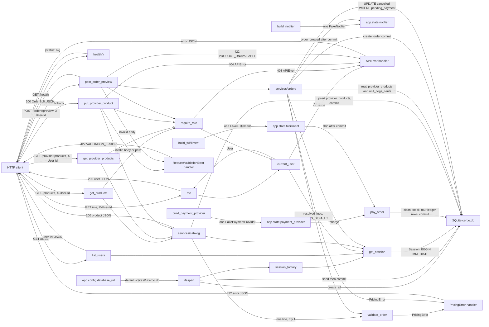
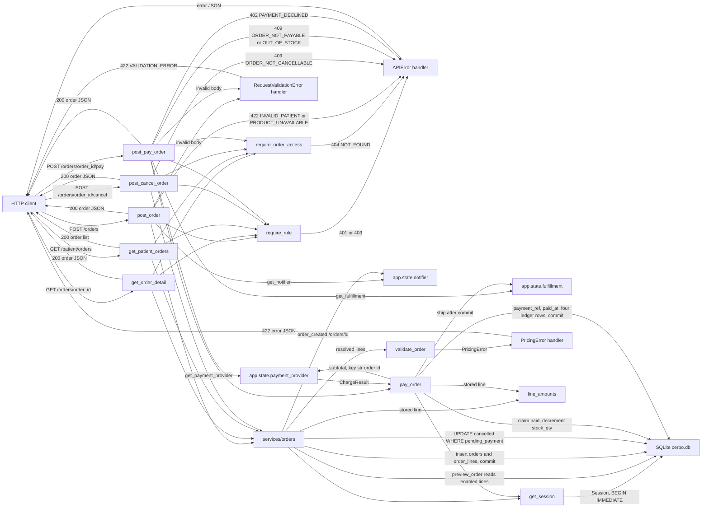

_Last updated: 2026-10-05 — T8: pay charges, writes stock and ledger, then ships._

# Data flow

Startup writes the seed into SQLite and keeps a session factory. `create_app` stores one `FakeNotifier` on `app.state.notifier`, one `FakePaymentProvider` on `app.state.payment_provider`, and one `FakeFulfillment` on `app.state.fulfillment`. `POST /orders/{order_id}/pay` reads the payment provider and the fulfillment stub. After startup, HTTP data moves on the health check, the user list, `GET /me`, the catalog routes, `POST /orders/preview`, `POST /orders`, `GET /orders/{order_id}`, `GET /patient/orders`, `POST /orders/{order_id}/cancel`, and `POST /orders/{order_id}/pay`. Catalog reads return product JSON. A provider price update validates one line, then writes that provider's `provider_products` row. An order preview reads `provider_products` and `products.unit_cogs_cents`, validates the resolved lines, and returns an `OrderSplit`. It does not write. Create copies that snapshot onto `orders` and `order_lines`, commits, then calls `order_created`. Reads and cancel return stored order columns. Pay claims the order, decrements `products.stock_qty`, charges the stored subtotal, writes `payment_ref`, `paid_at`, and four `ledger_entries`, commits, then calls `ship`. Line totals use `line_amounts` on the stored line. The pay receipt is that same order JSON. Ledger rows are not on it. The frontend renders a static heading and does not send or receive API data.

`POST /orders/preview` does not write or notify. The `create_order` and `cancel_order` edges above are the writes on `services/orders`. `pay_order` is the write on `services/payments`: it reads `app.state.payment_provider` and `app.state.fulfillment`. The next diagram shows which routes take the order writes, including pay:

## Startup

`create_app` stores `database_url` on `app.state` before the lifespan runs. The default is `sqlite:///./cerbo.db` from `app.config`. The same function calls `build_notifier()` and stores that object on `app.state.notifier`. `build_notifier` returns a `FakeNotifier`. Nothing else constructs one. The lifespan does not replace the notifier.

The same function calls `build_payment_provider()` and stores that object on `app.state.payment_provider`. `build_payment_provider` returns a `FakePaymentProvider` and is the only production constructor. The lifespan does not replace the provider. `post_pay_order` reads it through `get_payment_provider`, and `pay_order` calls `charge`.

The same function calls `build_fulfillment()` and stores that object on `app.state.fulfillment`. `build_fulfillment` returns a `FakeFulfillment` and is the only constructor. The lifespan does not replace it. `post_pay_order` reads it through `get_fulfillment`, and `pay_order` calls `ship` after the payment commit.

1. `make_engine` opens that URL. On connect it sets `PRAGMA foreign_keys=ON` and `PRAGMA busy_timeout=5000`. On begin it runs `BEGIN IMMEDIATE`. Pay uses that listener; it does not send its own `BEGIN`.
2. `init_db` calls `Base.metadata.create_all`, which creates `users`, `products`, `provider_products`, `orders`, `order_lines`, and `ledger_entries` when they are missing.
3. `seed(session)` stages rows that are not already present, matched by `users.name`, `products.sku`, and the `provider_products` pair. The lifespan then `commit`s. That writes Dr. Maya Patel (provider), Jane Doe and Sam Lee (patients), Cerbo Admin (admin), products MAG-GLY, D3-K2, OMEGA3, and PROBIO50, and Dr. Patel's four enabled `provider_products` at suggested prices. Seed does not insert `orders`, `order_lines`, or `ledger_entries`.
4. `make_session_factory` is saved on `app.state.session_factory`.
5. Shutdown calls `engine.dispose()`.

## GET /health

1. **In.** `GET /health` with no body, query, or auth.
2. **Transform.** `health()` builds `{"status": "ok"}`. FastAPI serializes it as JSON and returns HTTP 200.
3. **Out.** `{"status": "ok"}` goes back to the caller.
4. **Storage.** This route does not open a session and does not read or write SQLite.

## GET /users

1. **In.** `GET /users` with no auth header.
2. **Read.** `get_session` opens a `Session` and closes it without committing. `list_users` runs `select(User).order_by(User.id)`.
3. **Out.** HTTP 200 and a JSON list of `{id, name, role}` for every row. After the startup seed, that list is the four users above, ordered by `id`.

## GET /me

1. **In.** `GET /me` and header `X-User-Id`.
2. **Resolve.** `current_user` uses the same request session. A missing header, a value that is blank after trimming, a value that is not an ASCII digit string, or an integer above the signed 64-bit maximum raises `APIError` before any lookup. Any other value is loaded with `session.get(User, id)`. An unknown id raises the same error.
3. **Out, success.** `me` returns the `User`. FastAPI serializes `{id, name, role}` and returns HTTP 200.
4. **Out, failure.** The app's `APIError` handler returns HTTP 401 and `{"error": {"code": "UNAUTHENTICATED", "message": "Missing or unknown user", "line_index": null}}`.
5. **Storage.** The route only reads `users`. The session closes with no commit.

The branch detail is in `flows/auth.md`.

## GET /products

1. **In.** `GET /products` and header `X-User-Id`.
2. **Auth.** `require_role("provider", "admin")` resolves `current_user` first. Failure is 401 `UNAUTHENTICATED` or 403 `FORBIDDEN` "Wrong role". A patient is forbidden. A provider and an admin are allowed.
3. **Read.** `list_products` runs `select(Product).order_by(Product.id)`. The session closes with no commit.
4. **Out.** HTTP 200 and a JSON list of `{id, sku, name, unit_cogs_cents, suggested_price_cents, stock_qty}`. After the startup seed, that is MAG-GLY, D3-K2, OMEGA3, and PROBIO50, ordered by `id`.

## GET /provider/products

1. **In.** `GET /provider/products` and header `X-User-Id`.
2. **Auth.** `require_role("provider")`. An admin or a patient is 403 `FORBIDDEN`. A missing or unknown user is 401 `UNAUTHENTICATED`.
3. **Read.** `list_provider_products` joins `provider_products` to `products` where `provider_id` is the caller, ordered by `products.id`. `stock_qty` and `unit_cogs_cents` come from `products`. Rows for other providers are not included. A provider with no links gets `[]`.
4. **Out.** HTTP 200 and a JSON list of `{product_id, sku, name, enabled, default_price_cents, unit_cogs_cents, stock_qty}`. `enabled` is JSON `true` when the stored integer is `1`.
5. **Storage.** Read only. Stock is not writable on this route.

The read and update branches are in `flows/provider-products.md`.

## PUT /provider/products/{product_id}

1. **In.** `PUT /provider/products/{product_id}`, header `X-User-Id`, and a JSON body `{"enabled", "default_price_cents"}`.
2. **Auth.** `require_role("provider")`, same 401 and 403 outcomes as the provider list.
3. **Request validation.** `product_id` must be an integer. `ProviderProductUpdate` is strict: `enabled` is a JSON boolean and `default_price_cents` is a JSON integer. A bad path or body raises `RequestValidationError` before `update_provider_product`. The handler returns HTTP 422 and `{"error": {"code": "VALIDATION_ERROR", "message": "Invalid request", "line_index": null}}`. Nothing is written.
4. **Product lookup.** `update_provider_product` loads `products` by id. `UnknownProduct` is mapped in the route to `APIError` 404 `NOT_FOUND` "Not found". No price check and no write.
5. **Price check.** `validate_order` receives one `LineInput`: that `product_id`, `qty` 1, `unit_price_cents` equal to `default_price_cents`, and `unit_cogs_cents` from the product, plus `FEE_BPS_DEFAULT`. `PricingError` is not caught in the route. The app handler returns HTTP 422 and `{"error": {"code": <pricing code>, "message": <detail>, "line_index": <line index or null>}}`. Nothing is written.
6. **Write.** For this provider and product only, insert a `provider_products` row or update the existing one. The stored fields are `enabled` (`1` or `0`) and `default_price_cents`. `session.commit()` runs in the service. `products.stock_qty` and every other provider's rows stay as they were.
7. **Out.** HTTP 200 and one object with the same fields as a provider-list row. `stock_qty` is still the `products` value.

## POST /orders/preview

1. **In.** `POST /orders/preview`, header `X-User-Id`, and a JSON body `{"lines": [{"product_id", "qty", "unit_price_cents"}, ...]}`.
2. **Auth.** `require_role("provider")`. An admin or a patient is 403 `FORBIDDEN`. A missing or unknown user is 401 `UNAUTHENTICATED`.
3. **Request validation.** `PreviewRequest` and `PreviewLineRequest` are strict. Each line's `product_id`, `qty`, and `unit_price_cents` must be JSON integers. A bad body raises `RequestValidationError` before `preview_order`. The handler returns HTTP 422 and `{"error": {"code": "VALIDATION_ERROR", "message": "Invalid request", "line_index": null}}`. Nothing is written.
4. **Resolve, in order.** `preview_order` does not commit and does not insert, update, or delete. For each line, a `product_id` outside `1..9223372036854775807` is unavailable and is not queried. Otherwise it loads `provider_products` for `(provider_id, product_id)`. A missing row or `enabled` other than `1` is unavailable and does not read `products`. An enabled row then loads `products` and copies `unit_cogs_cents`. A missing product is unavailable. `stock_qty` is not read. `orders`, `order_lines`, and `ledger_entries` are not read or written.
5. **Unavailable line.** If any earlier line already resolved, `validate_order` runs on that prefix at `FEE_BPS_DEFAULT` before the unavailable error. A `PricingError` from the prefix is the response: HTTP 422, `code` is the pricing code, `message` is `detail`, and `line_index` is that error's line index. If the prefix is valid, or there is no prefix, the route maps `ProductUnavailable` to `APIError` 422 `PRODUCT_UNAVAILABLE`, message "Product is not available for this provider.", and `line_index` of the unavailable line. Nothing is written.
6. **Every line resolved.** `validate_order` runs on the full list at `FEE_BPS_DEFAULT`. An empty `lines` array takes this path and raises `EMPTY_ORDER`. Any other `PricingError` uses the same 422 handler as the prefix. Nothing is written.
7. **Out.** HTTP 200 and the `OrderSplit` fields: `lines` of `{product_id, qty, unit_price_cents, unit_cogs_cents, line_total_cents, line_cogs_cents, line_margin_cents}`, plus `subtotal_cents`, `cogs_total_cents`, `fee_bps`, `platform_fee_cents`, and `provider_payout_cents`.

The branch detail is in `flows/order-preview.md`. This route does not call the notifier.

## POST /orders

1. **In.** `POST /orders`, header `X-User-Id`, and a JSON body `{"patient_id", "lines"}`. Each line is `{"product_id", "qty", "unit_price_cents"}`, the same shape as preview.
2. **Auth.** `require_role("provider")`. An admin or a patient is 403 `FORBIDDEN`. A missing or unknown user is 401 `UNAUTHENTICATED`.
3. **Request validation.** `CreateOrderRequest` is strict. `patient_id` and each line's three fields must be JSON integers. A bad body raises `RequestValidationError` before `create_order`. The handler returns HTTP 422 `VALIDATION_ERROR`. Nothing is written.
4. **Notifier.** `get_notifier` reads `request.app.state.notifier` for this request. That is the instance `create_app` stored. The route passes it into `create_order`.
5. **Patient.** `create_order` checks the patient before preview. An id outside `1..9223372036854775807`, a missing `users` row, or a role other than `patient` raises `InvalidPatient`. The route maps that to 422 `INVALID_PATIENT`, message "Patient must be a patient user." Nothing is written.
6. **Price.** `preview_order` runs exactly as on `POST /orders/preview`, including `validate_order` at `FEE_BPS_DEFAULT`. `PricingError` is not caught in the route and becomes the same 422 pricing body. `ProductUnavailable` becomes 422 `PRODUCT_UNAVAILABLE` with `line_index`. Either one happens before the insert. `stock_qty` is not read.
7. **Names.** After the preview succeeds, `products.name` is copied for each line. A missing product raises `ProductUnavailable` and still writes nothing.
8. **Write.** One new `orders` row: the caller as `provider_id`, the requested `patient_id`, `status` `pending_payment`, `fee_bps` and the four order totals from the `OrderSplit`, `payment_ref` null, `created_at` as UTC `YYYY-MM-DDTHH:MM:SSZ`, `paid_at` null, `cancelled_at` null. `flush` assigns `orders.id`. Each line becomes an `order_lines` row: `product_id`, `product_name`, `qty`, `unit_price_cents`, and `unit_cogs_cents` from the snapshot. One `commit`. `products.stock_qty` is unchanged. No `ledger_entries` row is inserted.
9. **Notify.** After that commit, `order_created(order, "/orders/{id}")` runs. `FakeNotifier` prints `order created: /orders/{id}` and appends `(order.id, "/orders/{id}")` to `calls`. If `order_created` raises, the service logs the exception and still returns the order. The commit is not undone.
10. **Out.** HTTP 200 and the order JSON from `present_order`: stored order columns, `patient_link` `/orders/{id}`, and line totals from `line_amounts` on each stored line. The fee is the stored `fee_bps`, not a new calculation.

The branch detail is in `flows/orders.md`.

## GET /orders/{order_id}

1. **In.** `GET /orders/{order_id}` and header `X-User-Id`.
2. **Auth.** `require_role("provider", "patient")`. An admin is 403 `FORBIDDEN`. A missing or unknown user is 401 `UNAUTHENTICATED`.
3. **Request validation.** `order_id` must be an integer. A non-integer path raises `RequestValidationError` before the handler: HTTP 422 `VALIDATION_ERROR`. Nothing is written.
4. **Load.** An id outside `1..9223372036854775807`, or `session.get(Order, order_id)` missing, raises `OrderNotFound`. The route maps that to 404 `NOT_FOUND` "Not found".
5. **Access.** `require_order_access` allows the order's `provider_id` or `patient_id`. Any other user gets the same 404. The body does not say which case failed.
6. **Present.** `order_lines` loads `order_lines` for that id, ordered by `order_lines.id`. `present_order` copies stored order columns. For each line, `line_amounts(unit_price_cents, unit_cogs_cents, qty)` supplies `line_total_cents`, `line_cogs_cents`, and `line_margin_cents`. It does not read the live catalog and does not call `compute_fee`.
7. **Out.** HTTP 200 and one order object: `{id, provider_id, patient_id, status, patient_link, created_at, paid_at, cancelled_at, payment_ref, lines, subtotal_cents, cogs_total_cents, fee_bps, platform_fee_cents, provider_payout_cents}`. `patient_link` is `/orders/{id}`.
8. **Storage.** Read only. The session closes with no commit.

## GET /patient/orders

1. **In.** `GET /patient/orders` and header `X-User-Id`. No order id and no body.
2. **Auth.** `require_role("patient")`. A provider or an admin is 403 `FORBIDDEN`. A missing or unknown user is 401 `UNAUTHENTICATED`.
3. **Read.** `list_patient_orders` selects `orders` where `patient_id` is the caller, ordered by `orders.id`. For each row the route calls `require_order_access`, loads that order's lines, and `present_order`s them the same way as `GET /orders/{order_id}`.
4. **Out.** HTTP 200 and a JSON list of those order objects. A patient with no orders gets `[]`.
5. **Storage.** Read only.

## POST /orders/{order_id}/cancel

1. **In.** `POST /orders/{order_id}/cancel` and header `X-User-Id`. No body.
2. **Auth.** `require_role("provider")`. A patient or an admin is 403 `FORBIDDEN`. A missing or unknown user is 401 `UNAUTHENTICATED`.
3. **Request validation.** A non-integer `order_id` is 422 `VALIDATION_ERROR` before the handler. Nothing is written.
4. **Load and access.** The same `get_order` and `require_order_access` path as `GET /orders/{order_id}`. Missing or not owned is 404 `NOT_FOUND` "Not found", and `cancel_order` does not run.
5. **Status.** `cancel_order` does not branch on the loaded `status` in Python. It runs `UPDATE orders SET status='cancelled', cancelled_at=? WHERE id=? AND status='pending_payment'` with `synchronize_session=False`. `cancelled_at` is UTC `YYYY-MM-DDTHH:MM:SSZ`. One row commits, then the service expires the order and loads it again for `present_order`. Zero rows rolls back and raises `OrderNotCancellable`. The route maps that to 409 `ORDER_NOT_CANCELLABLE`, message "Order cannot be cancelled." `paid`, `cancelled`, and a lost race all take that path. The committed row stays as it was.
6. **Out.** HTTP 200 and the same order JSON as the get route, with `status` `cancelled` and the new `cancelled_at`. Line amounts still come from the stored lines through `line_amounts`.
7. **Unchanged.** No notifier call. `products.stock_qty` is unchanged. No `ledger_entries` row is inserted. `payment_ref` and `paid_at` stay as they were.

## POST /orders/{order_id}/pay

The branch detail is in `flows/pay.md`. This section is what moves.

1. **In.** `POST /orders/{order_id}/pay`, header `X-User-Id`, and a JSON body `{"payment_method": "fake_card_ok" | "fake_card_decline"}`.
2. **Auth.** `require_role("patient")`. A provider or an admin is 403 `FORBIDDEN`. A missing or unknown user is 401 `UNAUTHENTICATED`.
3. **Request validation.** `PayRequest` is strict. `payment_method` must be one of those two strings. A non-integer `order_id` or any other body is 422 `VALIDATION_ERROR` before `pay_order`. Nothing is written.
4. **Load and access.** The same `get_order` path as the get route, then `require_order_access`. Missing is 404 `NOT_FOUND`. A patient who is not that order's `patient_id` is the same 404. `pay_order` does not run.
5. **Session.** `pay_order` uses this request's session. The first SQL begins a transaction, and `db.make_engine`'s `begin` listener runs `BEGIN IMMEDIATE`. There is no second session.
6. **Already paid.** `status` `paid` returns `present_order` of the stored row and rolls back. `charge` is not called. `ship` is not called. A replay of a paid order is this path.
7. **Cancelled.** Any other status than `paid` or `pending_payment` rolls back and becomes 409 `ORDER_NOT_PAYABLE`, message "Order cannot be paid." Nothing is charged.
8. **Claim.** `UPDATE orders SET status='paid' WHERE id=? AND status='pending_payment'` with `synchronize_session=False`. Zero rows rolls back, expires the session, and the next attempt reads again. A paid re-read returns the receipt and does not charge or ship. A cancelled re-read is 409 and does not charge. A row that is still `pending_payment` tries the claim again, up to three attempts. Three lost claims become 409 `ORDER_NOT_PAYABLE`.
9. **Stock.** For each stored line, `UPDATE products SET stock_qty=stock_qty-qty WHERE id=? AND stock_qty>=qty`, also with `synchronize_session=False`. Any line with zero rows rolls back the claim and the stock changes. The route returns 409 `OUT_OF_STOCK`, message "Not enough stock." `charge` is not called.
10. **Charge.** `charge(subtotal_cents, idempotency_key=str(order.id), payment_method)`. `fake_card_decline` declines. A decline, or an approved result with `ref` null, rolls back and returns 402 `PAYMENT_DECLINED`, message "Payment was declined." `status` stays `pending_payment`. `ship` is not called. `fake_card_ok` approves with `ref` `fake_{order.id}`.
11. **Ledger.** The service sets `payment_ref` and `paid_at`, then inserts four `ledger_entries` from the stored order columns: `patient_payment` = `subtotal_cents`, `cerbo_cogs` = `cogs_total_cents`, `cerbo_fee` = `platform_fee_cents`, `provider_payable` = `provider_payout_cents`. `created_at` on each row is `paid_at`. One `commit` stores the claim, the stock decrements, those order fields, and the four ledger rows.
12. **Ship.** After the commit, `FakeFulfillment.ship` prints `would ship order #{id}` and appends the order id to `calls`. An exception is logged. The receipt is still returned. The commit is not undone.
13. **Out.** HTTP 200 and the same order JSON as `GET /orders/{order_id}`. Ledger rows are not on that body.

## Not registered

The provider dashboard, `GET /orders/{id}/audit`, and admin product routes are not registered.

`compute_split` and `compute_fee` run only when `validate_order` calls them. That happens on `PUT /provider/products/{product_id}` after the product is found, on `POST /orders/preview`, and on `POST /orders` because `create_order` calls `preview_order`. Pay does not call `validate_order`. `backend/tests/test_money.py` also calls the money module directly.

`line_amounts` runs from `present_order` for every order JSON response, including the pay receipt. Those display amounts are `unit_price_cents * qty`, `unit_cogs_cents * qty`, and the difference. They are not stored on `order_lines`. Ledger rows are not part of that JSON.
