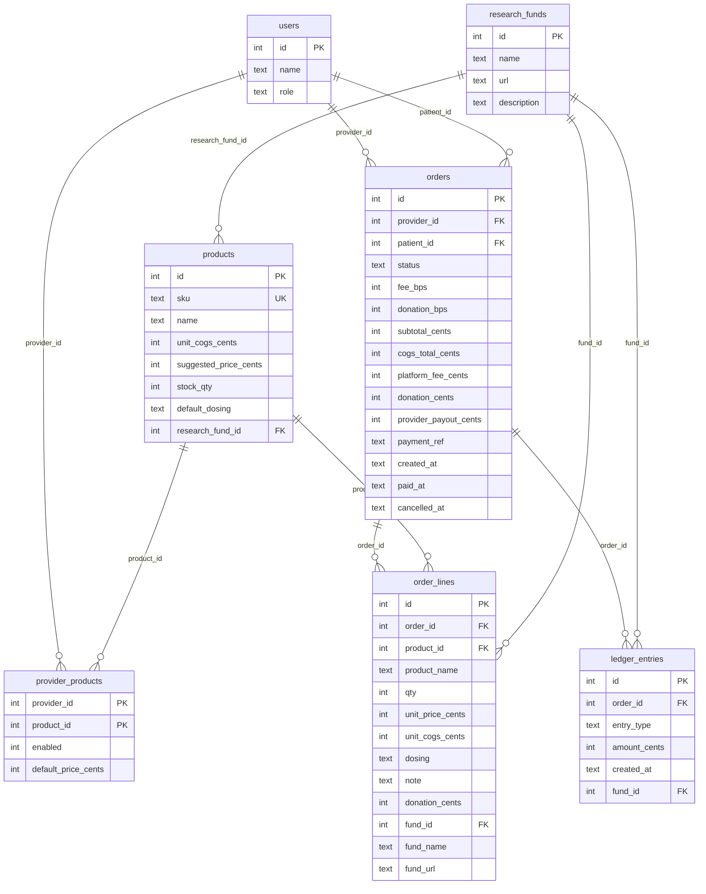

_Last updated: 2026-10-09 — T23: research_funds, donation columns, research_donation ledger, partial unique indexes._

# Data model

SQLAlchemy models in `backend/app/models.py`. Every table is SQLite **STRICT**. Money columns are `INTEGER` cents. Foreign keys are enforced only after `app.db.make_engine` runs `PRAGMA foreign_keys=ON` on connect.

## Checks and nullability

`provider_products.provider_id` and `provider_products.product_id` are a composite primary key and foreign keys to `users.id` and `products.id`. `products.research_fund_id` is nullable and FK to `research_funds.id`. `orders.payment_ref`, `orders.paid_at`, and `orders.cancelled_at` are nullable. `order_lines.note`, `order_lines.fund_id`, `order_lines.fund_name`, and `order_lines.fund_url` are nullable. `ledger_entries.fund_id` is nullable (required only for `research_donation`). Every other column above is `NOT NULL`.

| Table | Constraint |
|---|---|
| `users` | `role IN ('provider', 'patient', 'admin')` |
| `products` | `unit_cogs_cents > 0`, `suggested_price_cents > 0`, `stock_qty >= 0`, `length(default_dosing)` in `1..200`, `sku` unique |
| `provider_products` | `enabled IN (0, 1)`, `default_price_cents > 0` |
| `orders` | `status IN ('pending_payment', 'paid', 'cancelled')`, `fee_bps >= 0`, `donation_bps IN (0, 500)`, `subtotal_cents > 0`, `cogs_total_cents > 0`, `platform_fee_cents >= 0`, `donation_cents >= 0`, `provider_payout_cents >= 0`, and `subtotal_cents = cogs_total_cents + platform_fee_cents + donation_cents + provider_payout_cents` |
| `order_lines` | `qty >= 1`, `unit_price_cents > 0`, `unit_cogs_cents > 0`, `unit_price_cents >= unit_cogs_cents`, `donation_cents >= 0`, `(fund_id IS NULL AND donation_cents = 0) OR (fund_id IS NOT NULL)`, `length(dosing)` in `1..200`, `note IS NULL OR length(note) <= 500` |
| `ledger_entries` | `entry_type IN ('patient_payment', 'cerbo_cogs', 'cerbo_fee', 'provider_payable', 'research_donation')`, `amount_cents >= 0`, `(entry_type = 'research_donation' AND fund_id IS NOT NULL) OR (entry_type != 'research_donation' AND fund_id IS NULL)`, partial unique `uq_ledger_order_entry_type_non_donation` on `(order_id, entry_type)` where `entry_type != 'research_donation'`, partial unique `uq_ledger_order_fund_donation` on `(order_id, fund_id)` where `entry_type = 'research_donation'` |

`seed()` inserts four `research_funds` (matched by name) and links each seed product to one fund via `products.research_fund_id`. It does not insert `orders`, `order_lines`, or `ledger_entries`. `create_order` inserts one `orders` row with `status` `pending_payment` and one `order_lines` row per line. It copies `product_name`, `qty`, `unit_price_cents`, `unit_cogs_cents`, `dosing`, `note`, `donation_cents`, and fund snapshots (`fund_id`, `fund_name`, `fund_url`) onto the line, and copies `fee_bps`, `donation_bps`, `subtotal_cents`, `cogs_total_cents`, `platform_fee_cents`, `donation_cents`, and `provider_payout_cents` onto the order. `payment_ref` and `paid_at` stay null until pay. Create does not change `products.stock_qty` and does not insert `ledger_entries`.

`cancel_order` runs `UPDATE orders SET status='cancelled', cancelled_at=? WHERE id=? AND status='pending_payment'` with `synchronize_session=False`. One row commits. Zero rows rolls back and raises `OrderNotCancellable`. Cancel does not change stock, `payment_ref`, `paid_at`, or `ledger_entries`.

`pay_order` claims with `UPDATE orders SET status='paid' WHERE id=? AND status='pending_payment'`, also with `synchronize_session=False`. It then decrements `products.stock_qty` by each line's `qty` (`WHERE id=? AND stock_qty>=qty`). On approval it sets `payment_ref` and `paid_at` and inserts ledger rows whose `created_at` is that `paid_at`: four non-donation rows from the stored order columns (`patient_payment` = `subtotal_cents`, `cerbo_cogs` = `cogs_total_cents`, `cerbo_fee` = `platform_fee_cents`, `provider_payable` = `provider_payout_cents`, each with `fund_id` null), plus one `research_donation` row per fund that received a positive line donation (amount = sum of that fund's line `donation_cents`, `fund_id` set). Those amounts come from the stored order and line columns. The claim, stock updates, order fields, and ledger rows commit together. Ledger rows are not columns on the order JSON. Line totals in API responses are computed from the stored line by `line_amounts`; they are not columns. Line `donation_cents` is stored.

`list_admin_products` reads `products` ordered by `id` and does not insert, update, or delete. `update_admin_product` also writes `products`. It assigns only the columns the admin sent, `stock_qty` and/or `unit_cogs_cents`, with `synchronize_session=False`, then one `commit`. It does not change `sku`, `name`, `suggested_price_cents`, `default_dosing`, `research_fund_id`, `provider_products`, `orders`, `order_lines`, or `ledger_entries`. `order_lines.unit_cogs_cents` stays the value copied at create time. `preview_order` reads the current `products.unit_cogs_cents` and fund link for a new preview. `pay_order` still decrements `stock_qty` by each line's `qty` on payment. After seed, that decrement and this admin assignment are the two ways `products.stock_qty` changes.

`provider_dashboard` and `order_audit` only read `orders`, `order_lines`, `ledger_entries`, and `users`. They do not insert, update, or delete. `pay_order` is still the only writer of `ledger_entries`. Dashboard headlines sum `patient_payment`, `cerbo_fee`, `research_donation`, and `provider_payable` for this provider's paid orders (`gmv_cents`, `platform_fee_cents`, `donation_cents`, `earnings_cents`). `cerbo_cogs` stays on the ledger and is not part of those sums. The tables and relationships above are unchanged by reporting.
