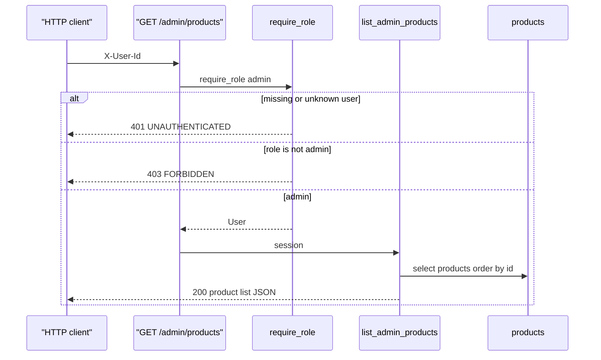
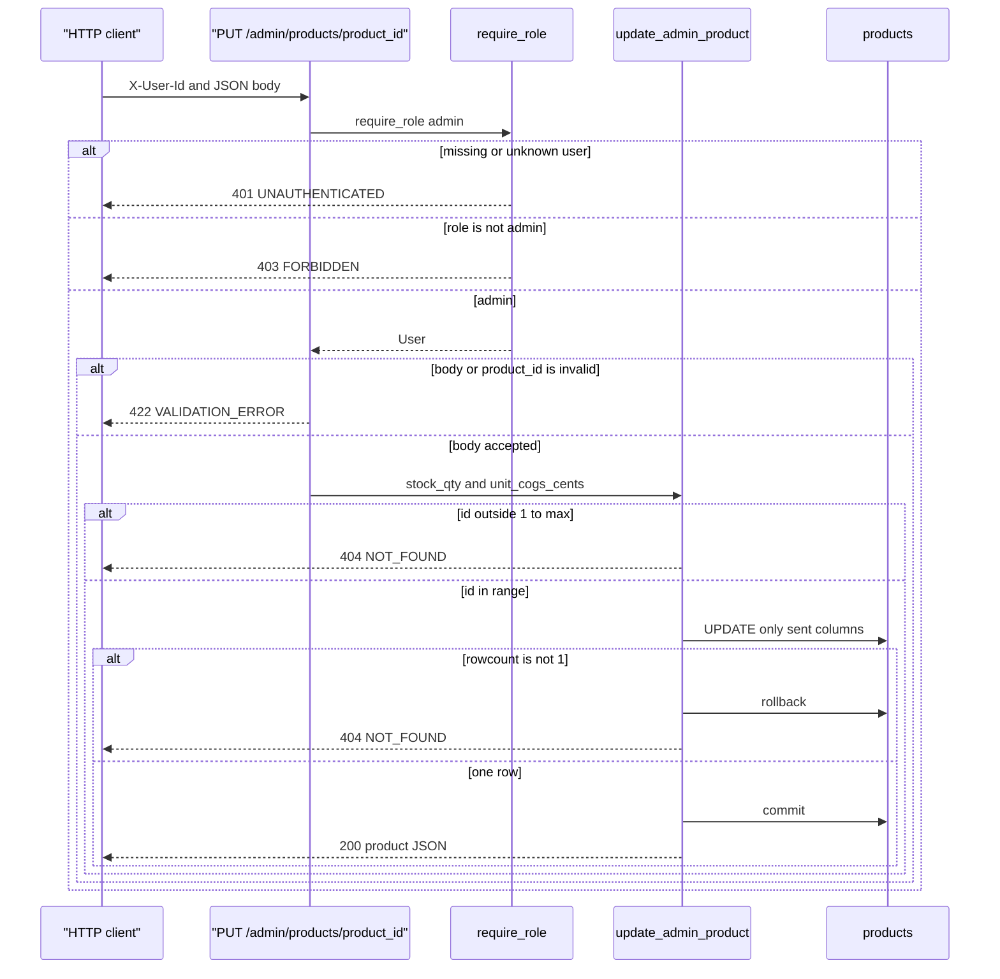

_Last updated: 2026-10-05 — T10: admin reads products and updates stock or COGS._

# Admin products

`GET /admin/products` and `PUT /admin/products/{product_id}` are registered from `api/admin.py`. `create_app` includes that router after `api/catalog`. Both routes depend on `require_role("admin")`, which depends on `current_user`. Queries and the write live in `services/admin.py`. See `data-flow.md`.

`get_session` opens a `Session` for the request and closes it with no extra commit. The list does not commit. The update commits inside `update_admin_product`.

## Read

The query is `select(Product).order_by(Product.id)`. Each row is `{id, sku, name, unit_cogs_cents, suggested_price_cents, stock_qty}`. No row is inserted or updated. The session closes with no commit.

401 and 403 use the `APIError` envelope: `{"error": {"code", "message", "line_index": null}}`. The 401 message is "Missing or unknown user". The 403 message is "Wrong role". A provider or a patient is 403.

## Update

**Auth.** A provider or a patient is 403 `FORBIDDEN` "Wrong role" before the body is applied. A missing or unknown user is 401 `UNAUTHENTICATED`.

**Body.** `AdminProductUpdate` is strict. `stock_qty` and `unit_cogs_cents` are optional JSON integers, and at least one is required. An omitted field is left unset and is not written. `stock_qty` must be from `0` through `9223372036854775807`. `unit_cogs_cents` must be from `1` through that same maximum. A non-integer `product_id`, a non-integer field, an empty body, `stock_qty` below 0, `unit_cogs_cents` below 1, or a value above that maximum is `RequestValidationError`. `app.main` maps that to 422 `VALIDATION_ERROR`, message "Invalid request", `line_index` null. `update_admin_product` does not run. Nothing is written.

**Unknown id.** An id outside `1..9223372036854775807` raises `UnknownProduct` before the `UPDATE`. A missing `products` row runs `UPDATE products ... WHERE id=?` with `synchronize_session=False`, sees a rowcount other than 1, rolls back, and raises `UnknownProduct`. The route maps either case to 404 `NOT_FOUND` "Not found".

**Write.** The `SET` clause contains only the columns the body sent. One matching row commits. The service expires the session and loads the product again. `sku`, `name`, and `suggested_price_cents` stay as they were. `provider_products`, `orders`, `order_lines`, and `ledger_entries` are not updated. An existing order keeps the `unit_cogs_cents` copied onto `order_lines` at create time. A later `preview_order` reads the new `products.unit_cogs_cents`.

**Out.** HTTP 200 and one object with the same fields as an admin-list row.
