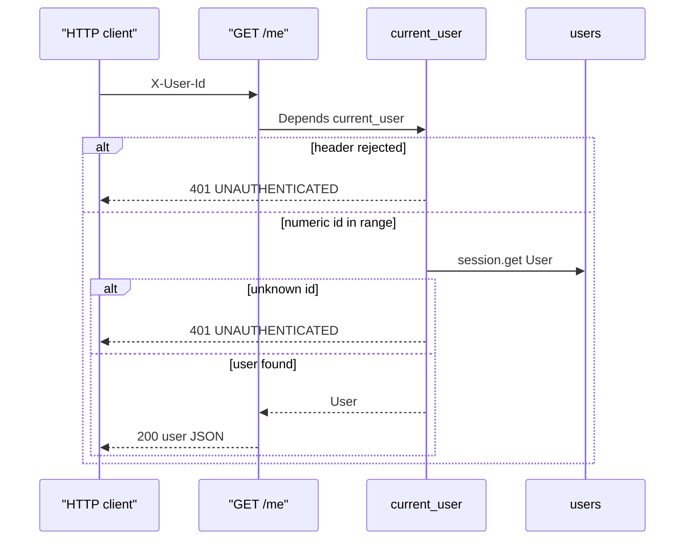

_Last updated: 2026-10-05 — T3: GET /me resolves X-User-Id to a user or 401._

# GET /me

`api/users.me` depends on `seams/auth.current_user`. The header is checked before any user lookup. `get_session` still opens a `Session` for the request and closes it with no commit, including on 401.

**Header rejected** means the header is missing, blank after trimming, not an ASCII digit string, or greater than the signed 64-bit maximum (`9223372036854775807`). Those cases never query `users`.

**Numeric id in range** is loaded with `session.get`. An unknown id takes the same 401 as a rejected header.

Both 401 responses are `{"error": {"code": "UNAUTHENTICATED", "message": "Missing or unknown user", "line_index": null}}`. The 200 body is `{id, name, role}`.
