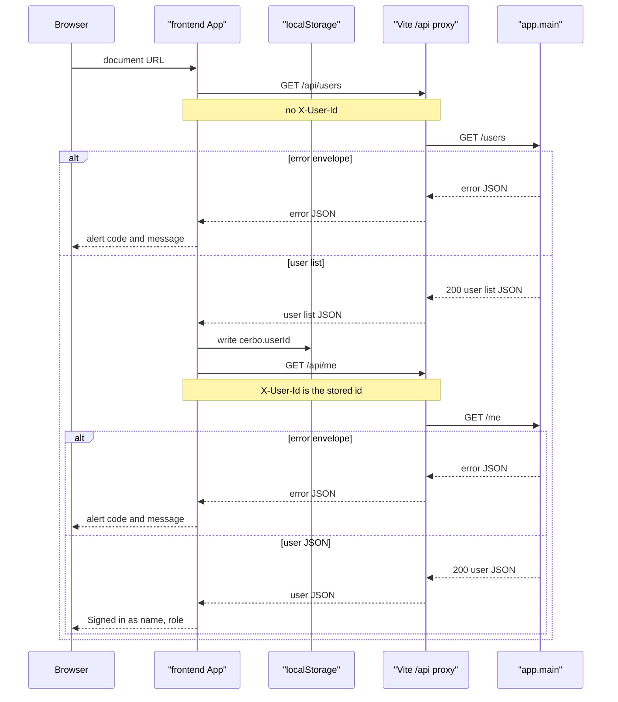
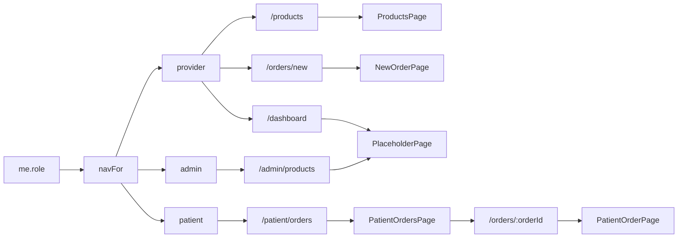
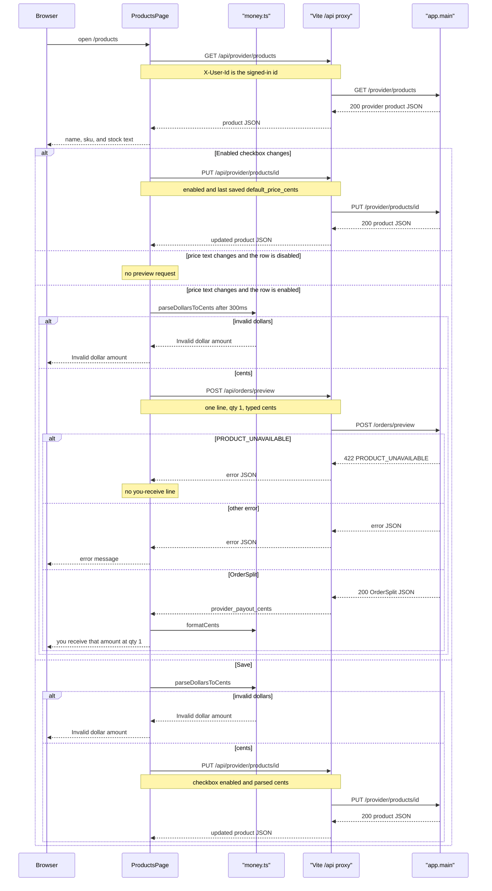
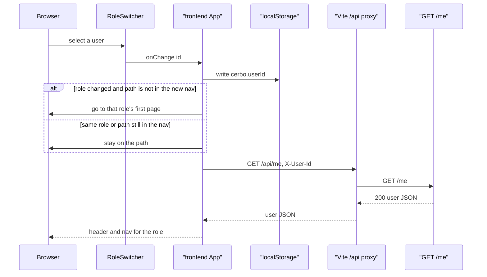
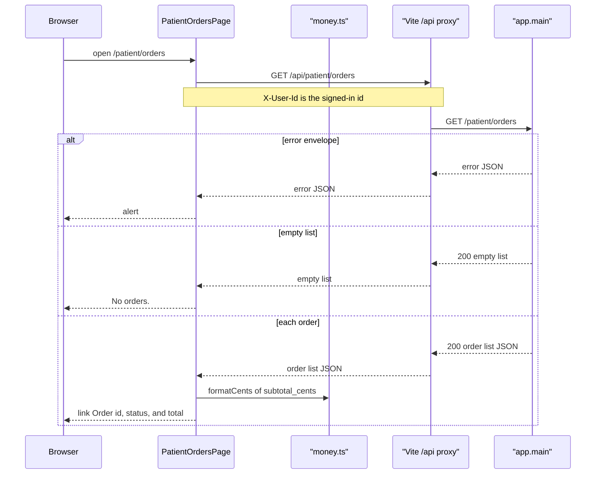
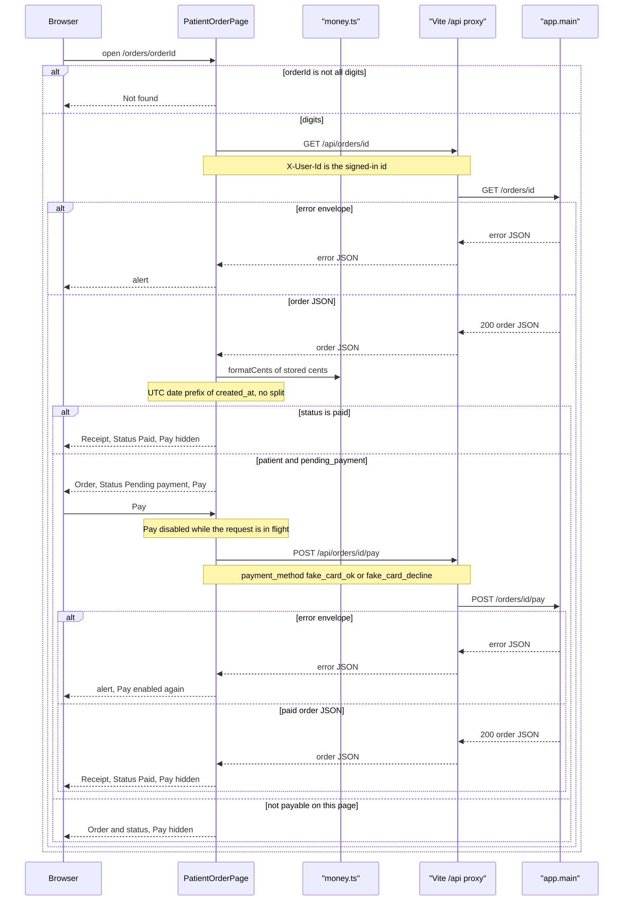

_Last updated: 2026-10-06 — T14: /patient/orders lists orders, and /orders/:orderId can pay._

# Frontend shell

`src/main.tsx` mounts `BrowserRouter`, Pico CSS, and `theme.css`, then renders `App`. `src/api/client.ts` calls relative URLs under `/api`. The Vite dev server proxies only `/api` to `http://127.0.0.1:8000` and strips the `/api` prefix. A document request such as `/orders/5` or `/products` is not proxied. It stays in the SPA. See `data-flow.md`.

## Load

`App` calls `apiGet("/users", null)` on mount. `RoleSwitcher` renders that list in a select. The stored id is `localStorage` key `cerbo.userId` when the value is digits and matches a listed user. Otherwise it is the first user. An empty list throws `Error` "No users" and does not call `GET /me`. `App` writes the chosen id, then calls `apiGet("/me", userId)`.

A response that is not OK is read as JSON. When `error.code` and `error.message` are strings and `error.line_index` is null or a number, `apiGet` throws `ApiError` with `code`, `message`, and `lineIndex`. The header alert shows `code: message`. Any other failure becomes `Error` "Request failed".

`/` renders "Loading account…" until `GET /me` returns. It then replaces the location with that role's first page.

## Role and routes

The link labels are Products, New order, Dashboard, My orders, and Stock & COGS. `/products` renders `ProductsPage` with the signed-in user id. `/orders/new` is registered as a static route, before `/orders/:orderId`, and still renders `NewOrderPage` with that user id. `App` sets that route `key` to the user id, so a different signed-in user remounts the page. `/patient/orders` renders `PatientOrdersPage` with that user id, and its route `key` is the user id. `/orders/:orderId` renders `PatientOrderRoute` with that user id and role. `PatientOrderRoute` renders `PatientOrderPage` with `key` set to the order id. `/dashboard` and `/admin/products` still render `PlaceholderPage` with that title and the signed-in name and role. Those placeholder pages do not fetch. `/orders/:orderId/audit` is not registered, so that document URL has no page. The header still renders.

## Products

`ProductsPage` calls `apiGet("/provider/products", userId)` when it mounts. The client fetches `/api/provider/products` with `X-User-Id`. The proxy strips `/api`. A failed list shows the error message and no rows. Each row shows `name`, `sku`, and stock as `{n} in stock` or `Out of stock`. Stock is not an input and is not sent back.

The checkbox PUT does not send the unsaved typed price. Turning a row off clears the you-receive line and the preview error. `PRODUCT_UNAVAILABLE` from preview is ignored: the row shows no payout and no preview error. Any other preview or save failure shows the error message. The browser does not compute the split.

The first page is `/products` for a provider, `/patient/orders` for a patient, and `/admin/products` for an admin. A role change whose current path is already in the new nav does not navigate. The redirect uses the role on the user already loaded from `GET /users`. `GET /me` then runs again because the selected id changed. A failed `GET /me` throws `ApiError` the same way as the first load. A new id remounts `NewOrderPage`, `PatientOrdersPage`, and `PatientOrderRoute` because each route `key` is that id. `PatientOrderPage` also remounts when the order id changes, because `PatientOrderRoute` sets its `key` to the order id.

## New order

`NewOrderPage` mounts with the signed-in user id. It calls `apiGet("/users", userId)` and `apiGet("/provider/products", userId)` together. Both fetches use `/api` and set `X-User-Id`. The proxy strips `/api`. Either failure shows `ApiError.message`, another error's message, or "Request failed", and the builder does not render. Until both lists return, the page shows "Loading order…".

Patients are the listed users whose `role` is `patient`. The product picker lists only products with `enabled` true. Stock is `{n} in stock`, or `Out of stock` when `stock_qty` is 0. Add appends a line with qty `1` and a unit price of `formatCents(default_price_cents)`. Remove drops that line. The page does not compute the fee split.

Qty must match `^[1-9]\d*$` and be a safe integer. Any other qty shows "Quantity must be at least 1." The unit price goes through `parseDollarsToCents`. A thrown `Error` shows that message. Preview waits `300` ms and POSTs `{lines: [{product_id, qty, unit_price_cents}]}`. Editing a line clears the current preview error. The shown preview is the response whose lines still match the draft. A numeric `line_index` is shown on that line. `line_index` null is shown once under the lines. Either one disables Continue, as does a missing patient or a preview that does not match the current lines. When Continue is disabled, the page shows one short reason, in this order: Pick a patient when no patient is selected, Add at least one item when the line list is empty, Fix the errors above when a line is invalid or a preview error is set, and Checking prices while the matching preview is not back yet.

On the builder, the breakdown is Subtotal, COGS, Platform fee, and You receive. You receive formats `provider_payout_cents` inside the `you-receive` class. Each priced line shows `line_total_cents`, `line_cogs_cents`, and `line_margin_cents`.

Review stays on `/orders/new`. It shows the patient name, and for each preview line the product name, qty, unit price, line total, COGS, and margin. The breakdown labels are Patient pays, COGS, Platform fee, and You receive. It also shows "Later catalog changes don't affect this order." Back sets the step to the builder and does not POST. Confirm POSTs `/orders` with `patient_id` and the preview lines' `product_id`, `qty`, and `unit_price_cents`. An `ApiError` whose `lineIndex` is a number clears the preview, returns to the builder, and shows that message on the line. Any other create error stays on review. The preview effect depends on the lines and the user id, not on the step. A failed preview sets the problem and does not change the step. On review, that message is the alert, the heading stays Review order, and Confirm stays disabled. The page does not return to the builder for a preview error. Success shows "Order created", the patient name, and `patient_link` from the response. The page does not build that path. Copy calls `navigator.clipboard.writeText` with `patient_link`. A failed copy shows "Could not copy the link".

## My orders

`PatientOrdersPage` mounts with the signed-in user id. It calls `apiGet("/patient/orders", userId)`. The client fetches `/api/patient/orders` with `X-User-Id`. The proxy strips `/api`. Until the list returns, the page shows "Loading orders…". A failure shows `errorText` in an alert and no list.

The heading is My orders. Each order is an article. The link text is `Order {id}` and the path is `/orders/{id}`. Status text is Pending payment, Paid, or Cancelled. Any other status is shown as stored. Total is `formatCents(subtotal_cents)`. The page does not compute a split.

## Order and pay

`/orders/:orderId` renders `PatientOrderRoute`. That component reads `orderId` from the path and renders `PatientOrderPage` with `key` set to that id. A missing id, or an id that is not all digits, shows Not found and does not call `GET /orders/{id}`. Otherwise the page calls `apiGet("/orders/{orderId}", userId)` through `/api` with `X-User-Id`. Until the order returns, the page shows "Loading order…". A failure shows `errorText` in an alert.

The heading is Receipt when `status` is `paid`, and Order otherwise. Status text matches the list: Pending payment, Paid, Cancelled, or the stored status. Each line shows `product_name`, qty, `formatCents(unit_price_cents)`, and `formatCents(line_total_cents)`. Total is `formatCents(subtotal_cents)`. The page does not show COGS, the platform fee, or the provider payout, and it does not compute the split.

The date line is `Prices set by your provider on {Mon D}`. `orderDateLabel` reads the `YYYY-MM-DD` prefix of `created_at`. The stored value is UTC `YYYY-MM-DDTHH:MM:SSZ`, so that prefix is the UTC date. The month is Jan through Dec and the day has no leading zero. A prefix that does not match is shown as the stored `created_at`.

Pay is shown only when `role` is `patient` and `status` is `pending_payment`. The select sends `fake_card_ok` (OK test card, the default) or `fake_card_decline` (Decline test card). Pay POSTs `{payment_method}` to `/orders/{id}/pay`. The button is disabled while that request is in flight, and a ref blocks a second call before the state updates. A success replaces the order. A paid body renders Receipt, status Paid, and hides Pay. An error shows an alert and leaves the loaded order in place, so a declined `pending_payment` order can be paid again. A cancelled order, a non-patient, and any status other than `pending_payment` hide Pay.

## Dollars and generated types

`src/lib/money.ts` exports `parseDollarsToCents` and `formatCents`. `ProductsPage` and `NewOrderPage` call both. `PatientOrdersPage` and `PatientOrderPage` call `formatCents` on stored cents. They do not call `parseDollarsToCents`. `parseDollarsToCents` accepts an optional leading `$` and commas only as thousands separators, then returns integer cents. A comma that is not a thousands separator is invalid. `formatCents` prints `$` and groups thousands. Neither function computes a split. The you-receive line formats `provider_payout_cents` from `POST /orders/preview`. On `/orders/new` that line uses the `you-receive` class. The order builder also formats `subtotal_cents`, `cogs_total_cents`, `platform_fee_cents`, and each line's `line_total_cents`, `line_cogs_cents`, and `line_margin_cents`. The patient order page formats `unit_price_cents`, `line_total_cents`, and `subtotal_cents` from the order JSON.

`npm run gen:api` runs `openapi-typescript` against `http://127.0.0.1:8000/openapi.json` and writes `src/api/schema.ts`. `RoleSwitcher` imports `UserResponse` from that file. `ProductsPage` imports `ProviderProductResponse` and `PreviewResponse`. `NewOrderPage` imports `ProviderProductResponse`, `PreviewResponse`, `PreviewLineResponse`, and `OrderResponse`. Its `User` type comes from `RoleSwitcher`. `PatientOrdersPage` and `PatientOrderPage` import `OrderResponse`. The running page does not request the OpenAPI document.
