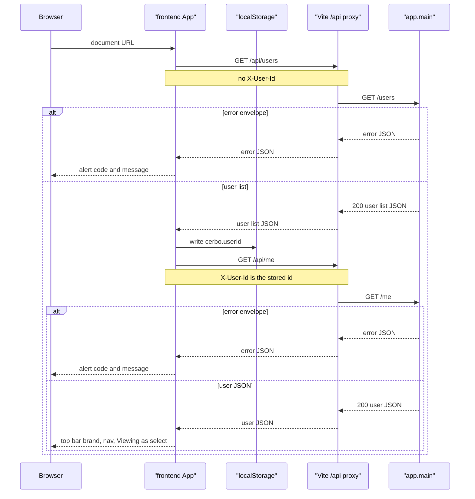
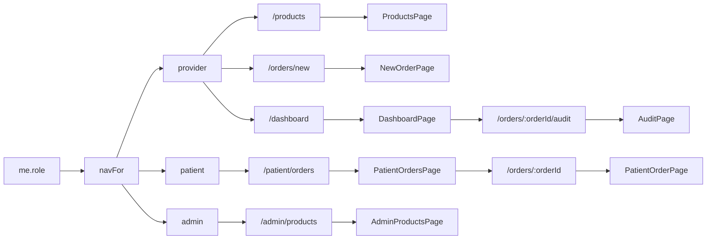
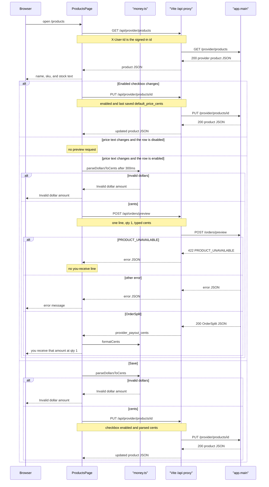
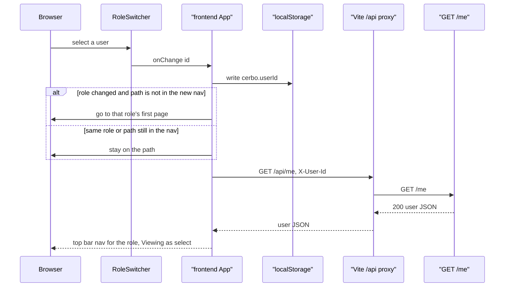
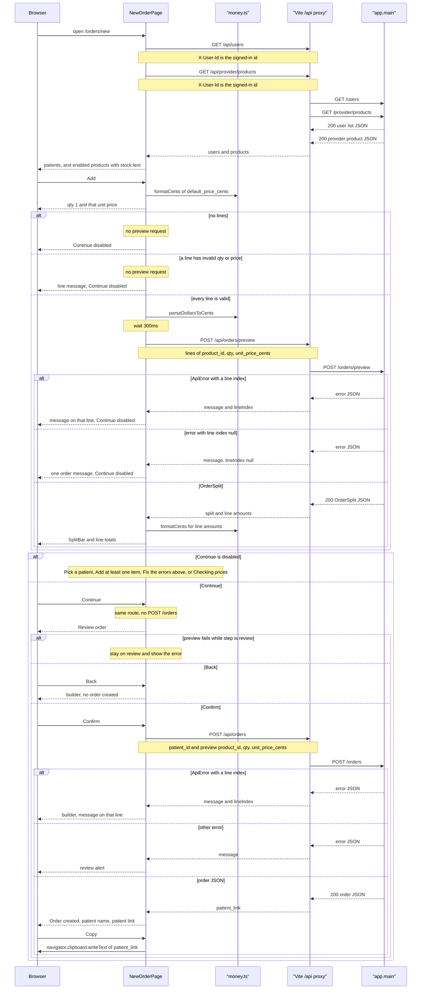
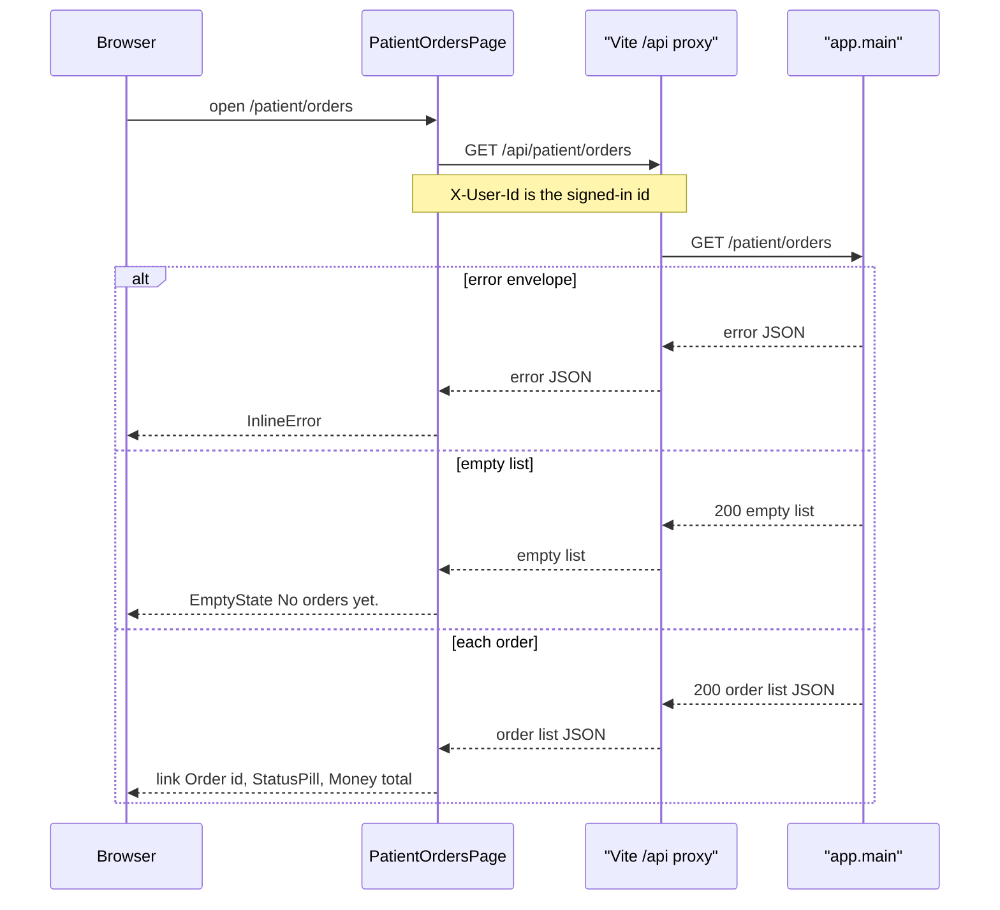
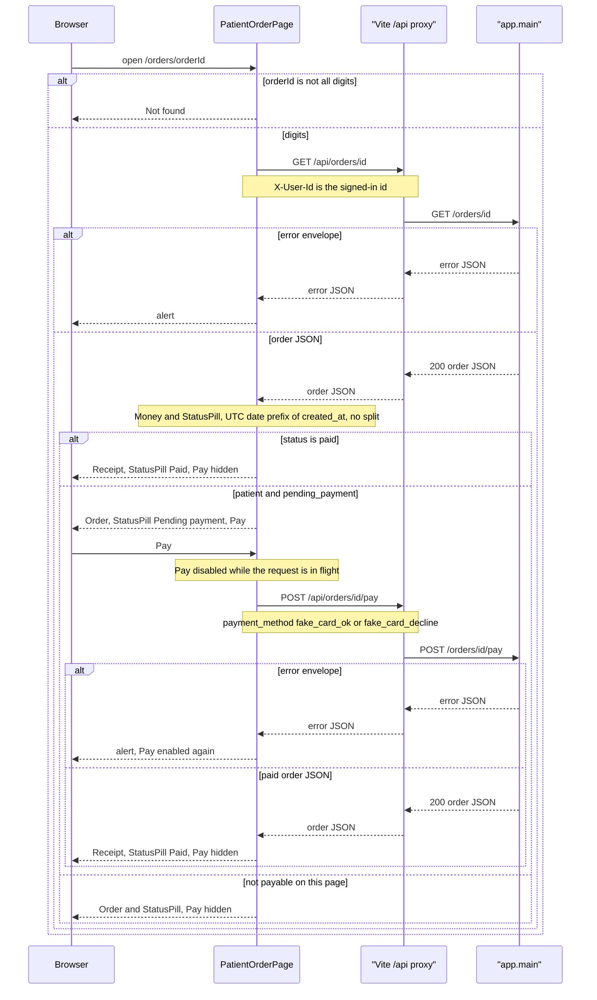
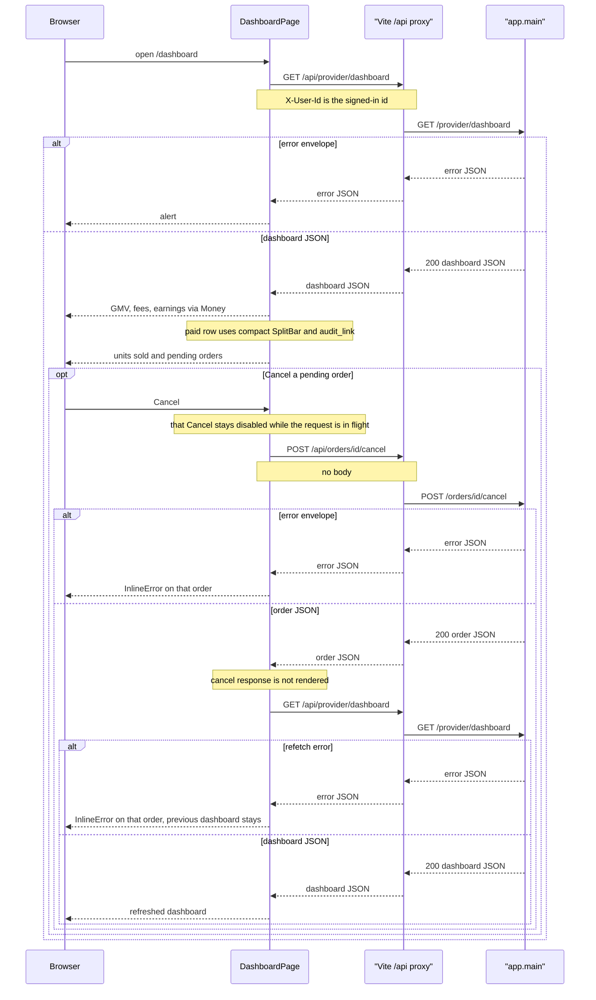
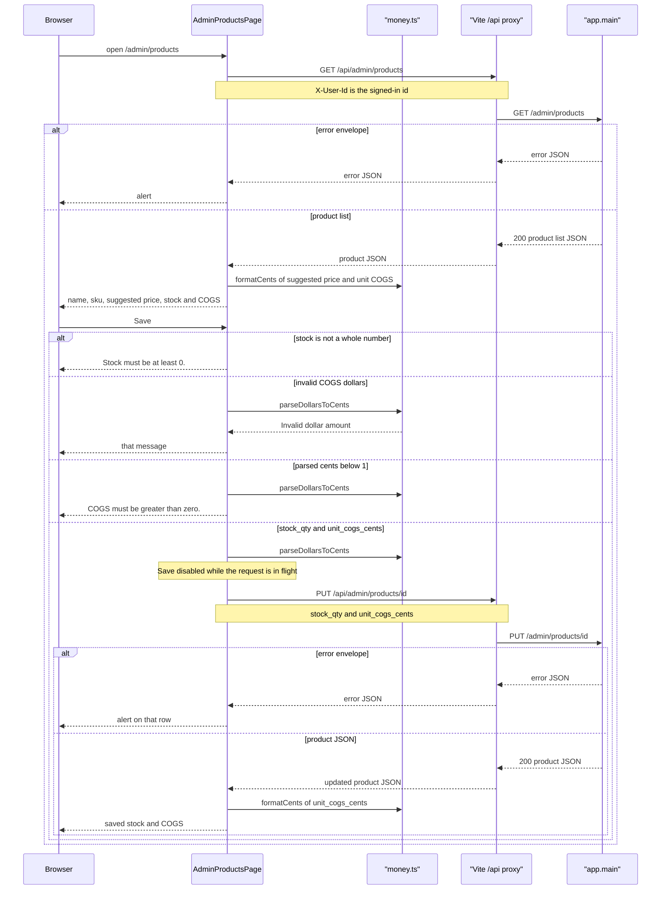

_Last updated: 2026-10-06 — T18: hand-written theme, top bar shell, shared UI components._

# Frontend shell

`src/main.tsx` mounts `BrowserRouter`, imports `@fontsource-variable/inter` and hand-written `theme.css` (tokens from `docs/ui-design.md`), then renders `App`. Pico is not used. `App` renders a sticky top bar (`app-topbar`) with the Cerbo / Supplements wordmark, role nav, and a demo `RoleSwitcher` labeled "Viewing as" (dashed border). `src/api/client.ts` calls relative URLs under `/api`. The Vite dev server proxies only `/api` to `http://127.0.0.1:8000` and strips the `/api` prefix. A document request such as `/orders/5` or `/products` is not proxied. It stays in the SPA. See `data-flow.md`.

## Load



`App` calls `apiGet("/users", null)` on mount. `RoleSwitcher` renders that list in a select labeled "Viewing as". The stored id is `localStorage` key `cerbo.userId` when the value is digits and matches a listed user. Otherwise it is the first user. An empty list throws `Error` "No users" and does not call `GET /me`. `App` writes the chosen id, then calls `apiGet("/me", userId)`. The top bar does not print a separate "Signed in as" line; the select options are `name (role)`.

A response that is not OK is read as JSON. When `error.code` and `error.message` are strings and `error.line_index` is null or a number, `apiGet` throws `ApiError` with `code`, `message`, and `lineIndex`. The top-bar banner alert shows `code: message`. Any other failure becomes `Error` "Request failed".

`/` renders "Loading account…" until `GET /me` returns. It then replaces the location with that role's first page.

## Role and routes



The link labels are Products, New order, Dashboard, My orders, and Stock & COGS. `/products` renders `ProductsPage` with the signed-in user id. `/orders/new` is registered as a static route, before `/orders/:orderId`, and still renders `NewOrderPage` with that user id. `App` sets that route `key` to the user id, so a different signed-in user remounts the page. `/patient/orders` renders `PatientOrdersPage` with that user id, and its route `key` is the user id. `/orders/:orderId` renders `PatientOrderRoute` with that user id and role. `PatientOrderRoute` renders `PatientOrderPage` with `key` set to the order id. `/orders/new` and `/orders/:orderId` are unchanged. `/dashboard` renders `DashboardPage` with that user id, and its route `key` is the user id. `/orders/:orderId/audit` renders `AuditRoute` with that user id, and its route `key` is the user id. `AuditRoute` renders `AuditPage` with `key` set to the order id. `/admin/products` renders `AdminProductsPage` with that user id, and its route `key` is the user id. No route renders `PlaceholderPage`. The sticky top bar still renders on every route. Shared presentational components live under `src/components/`: `SplitBar` (+ `splitBar.ts`), `StatusPill`, `Money`, `InlineError`, and `EmptyState`. Routes and API calls are unchanged.

## Products

`ProductsPage` calls `apiGet("/provider/products", userId)` when it mounts. The client fetches `/api/provider/products` with `X-User-Id`. The proxy strips `/api`. A failed list shows the error message and no rows. Each row shows `name`, `sku`, and stock as `{n} in stock` or `Out of stock`. Stock is not an input and is not sent back.



The checkbox PUT does not send the unsaved typed price. Turning a row off clears the you-receive line and the preview error. `PRODUCT_UNAVAILABLE` from preview is ignored: the row shows no payout and no preview error. Any other preview or save failure shows the error message. The browser does not compute the split.



The first page is `/products` for a provider, `/patient/orders` for a patient, and `/admin/products` for an admin. A role change whose current path is already in the new nav does not navigate. The redirect uses the role on the user already loaded from `GET /users`. `GET /me` then runs again because the selected id changed. A failed `GET /me` throws `ApiError` the same way as the first load. A new id remounts `NewOrderPage`, `DashboardPage`, `PatientOrdersPage`, `PatientOrderRoute`, `AuditRoute`, and `AdminProductsPage` because each route `key` is that id. `PatientOrderPage` also remounts when the order id changes, because `PatientOrderRoute` sets its `key` to the order id. `AuditPage` remounts when the order id changes, because `AuditRoute` sets its `key` to the order id.

## New order

`NewOrderPage` mounts with the signed-in user id. It calls `apiGet("/users", userId)` and `apiGet("/provider/products", userId)` together. Both fetches use `/api` and set `X-User-Id`. The proxy strips `/api`. Either failure shows `ApiError.message`, another error's message, or "Request failed", and the builder does not render. Until both lists return, the page shows "Loading order…".

Patients are the listed users whose `role` is `patient`. The product picker lists only products with `enabled` true. Stock is `{n} in stock`, or `Out of stock` when `stock_qty` is 0. Add appends a line with qty `1` and a unit price of `formatCents(default_price_cents)`. Remove drops that line. The page does not compute the fee split.



Qty must match `^[1-9]\d*$` and be a safe integer. Any other qty shows "Quantity must be at least 1." The unit price goes through `parseDollarsToCents`. A thrown `Error` shows that message. Preview waits `300` ms and POSTs `{lines: [{product_id, qty, unit_price_cents}]}`. Editing a line clears the current preview error. The shown preview is the response whose lines still match the draft. A numeric `line_index` is shown on that line. `line_index` null is shown once under the lines. Either one disables Continue, as does a missing patient or a preview that does not match the current lines. When Continue is disabled, the page shows one short reason, in this order: Pick a patient when no patient is selected, Add at least one item when the line list is empty, Fix the errors above when a line is invalid or a preview error is set, and Checking prices while the matching preview is not back yet.

On the builder, a matching preview renders `SplitBar` with caption Subtotal and the stored `subtotal_cents`, `cogs_total_cents`, `platform_fee_cents`, and `provider_payout_cents`. `SplitBar` / `splitBarLayout` only sizes segments and labels with `formatCents`; it does not recompute the fee. Each priced line still shows `line_total_cents`, `line_cogs_cents`, and `line_margin_cents` via `formatCents`.

Review stays on `/orders/new`. It shows the patient name, and for each preview line the product name, qty, unit price, line total, COGS, and margin. The same `SplitBar` uses caption Patient pays. It also shows "Later catalog changes don't affect this order." Back sets the step to the builder and does not POST. Confirm POSTs `/orders` with `patient_id` and the preview lines' `product_id`, `qty`, and `unit_price_cents`. An `ApiError` whose `lineIndex` is a number clears the preview, returns to the builder, and shows that message on the line. Any other create error stays on review. The preview effect depends on the lines and the user id, not on the step. A failed preview sets the problem and does not change the step. On review, that message is the alert, the heading stays Review order, and Confirm stays disabled. The page does not return to the builder for a preview error. Success shows "Order created", the patient name, and `patient_link` from the response. The page does not build that path. Copy calls `navigator.clipboard.writeText` with `patient_link`. A failed copy shows "Could not copy the link".

## My orders

`PatientOrdersPage` mounts with the signed-in user id. It calls `apiGet("/patient/orders", userId)`. The client fetches `/api/patient/orders` with `X-User-Id`. The proxy strips `/api`. Until the list returns, the page shows "Loading orders…". A failure renders `InlineError` with `errorText` and no list.



The heading is My orders. Each order is an article. The link text is `Order {id}` and the path is `/orders/{id}`. Status is a `StatusPill` (Pending payment, Paid, Cancelled, or the stored status). Total is `<Money cents={subtotal_cents} />`, which calls `formatCents`. The page does not compute a split.

## Order and pay

`/orders/:orderId` renders `PatientOrderRoute`. That component reads `orderId` from the path and renders `PatientOrderPage` with `key` set to that id. A missing id, or an id that is not all digits, shows Not found and does not call `GET /orders/{id}`. Otherwise the page calls `apiGet("/orders/{orderId}", userId)` through `/api` with `X-User-Id`. Until the order returns, the page shows "Loading order…". A failure shows `errorText` in an alert. Amounts render through `Money`; status through `StatusPill`.



The heading is Receipt when `status` is `paid`, and Order otherwise. Status is a `StatusPill`. Each line shows `product_name`, qty, and `Money` for `unit_price_cents` and `line_total_cents`. Total is `Money` of `subtotal_cents`. The page does not show COGS, the platform fee, or the provider payout, and it does not compute the split.

The date line is `Prices set by your provider on {Mon D}`. `orderDateLabel` reads the `YYYY-MM-DD` prefix of `created_at`. The stored value is UTC `YYYY-MM-DDTHH:MM:SSZ`, so that prefix is the UTC date. The month is Jan through Dec and the day has no leading zero. A prefix that does not match is shown as the stored `created_at`.

Pay is shown only when `role` is `patient` and `status` is `pending_payment`. The select sends `fake_card_ok` (OK test card, the default) or `fake_card_decline` (Decline test card). Pay POSTs `{payment_method}` to `/orders/{id}/pay`. The button is disabled while that request is in flight, and a ref blocks a second call before the state updates. A success replaces the order. A paid body renders Receipt, status Paid, and hides Pay. An error shows an alert and leaves the loaded order in place, so a declined `pending_payment` order can be paid again. A cancelled order, a non-patient, and any status other than `pending_payment` hide Pay.

## Dashboard

`DashboardPage` mounts with the signed-in user id. It calls `apiGet("/provider/dashboard", userId)`. The client fetches `/api/provider/dashboard` with `X-User-Id`. The proxy strips `/api`. Until the dashboard returns, the page shows "Loading dashboard…". A failure shows `errorText` from `src/api/client.ts` in an alert and no figures. That helper uses the API `message` for an `ApiError`.



The heading is Dashboard. GMV, Platform fees, and Earnings are `Money` of `gmv_cents`, `platform_fee_cents`, and `earnings_cents` (Earnings uses `emphasize`). The page does not compute a fee split.

Paid orders use the heading Paid orders. An empty list renders `EmptyState` "No paid orders yet. Create one from" with a New order link to `/orders/new`. Otherwise a table shows Date, Patient, Subtotal, Fee, Payout, Split, and Audit. Date is the UTC `YYYY-MM-DD` prefix of `paid_at`, shown as Mon D, or the stored value when that prefix does not match. Patient is `patient_name`. The money columns are `Money` of `subtotal_cents`, `platform_fee_cents`, and `provider_payout_cents` (payout emphasized). The Split column is a compact `SplitBar`; COGS for the bar is `subtotal_cents - platform_fee_cents - provider_payout_cents` for drawing only. The Audit link text is Audit and its path is `audit_link` from that row. The page does not build `/orders/{id}/audit`.

Units sold uses the heading Units sold. An empty list says No units sold. Each row is `product_name` and `qty`.

Pending orders uses the heading Pending orders. An empty list says No pending orders. Each order shows Order {id}, `patient_name`, and the same date label on `created_at`. Cancel POSTs `/orders/{id}/cancel` with no body. The button is disabled while that id is in flight, and a ref blocks a second call for that id before the state updates. The cancel response is not rendered. A success GETs `/provider/dashboard` again and replaces the page. A failed cancel, or a failed refetch, shows `InlineError` on that order and leaves the loaded dashboard in place.

## Audit

`/orders/:orderId/audit` renders `AuditRoute`. That component reads `orderId` from the path and renders `AuditPage` with `key` set to that id. A missing id, or an id that is not all digits, shows Not found and does not call `GET /orders/{id}/audit`. Otherwise the page calls `apiGet("/orders/{orderId}/audit", userId)` through `/api` with `X-User-Id`. Until the audit returns, the page shows "Loading audit…". A failure shows `errorText` in an alert.

```mermaid
sequenceDiagram
  participant Browser
  participant Route as AuditRoute
  participant Page as AuditPage
  participant Proxy as "Vite /api proxy"
  participant API as "app.main"

  Browser->>Route: open /orders/orderId/audit
  Route->>Page: key is orderId
  alt orderId is not all digits
    Page-->>Browser: Not found
  else digits
    Page->>Proxy: GET /api/orders/id/audit
    Note over Page,Proxy: X-User-Id is the signed-in id
    Proxy->>API: GET /orders/id/audit
    alt error envelope
      API-->>Proxy: error JSON
      Proxy-->>Page: error JSON
      Page-->>Browser: alert
    else audit JSON
      API-->>Proxy: 200 audit JSON
      Proxy-->>Page: lines, stored split, ledger, flags
      Note over Page: Money, StatusPill, SplitBar; does not compute the fee
      Page-->>Browser: lines, SplitBar, ledger, and three integrity flags
    end
  end
```

The heading is Audit. The page shows Order {id} and a `StatusPill` for status. Each line shows `product_name`, qty, and `Money` for `unit_price_cents`, `unit_cogs_cents`, and `line_total_cents`.

The split heading is Split. The page renders `SplitBar` with the stored `subtotal_cents`, `cogs_total_cents`, `platform_fee_cents`, and `provider_payout_cents` (default caption Patient pays). It does not compute the fee.

The ledger heading is Ledger. An empty list says No ledger entries. Each row shows a label for `entry_type` and `Money` of `amount_cents`. The labels are Patient payment, Cerbo COGS, Cerbo fee, and Provider payable. Any other `entry_type` is shown as stored.

The integrity heading is Integrity. The three flags come from the response: `recomputed_fee_matches` is Fee matches formula, `split_adds_up` is Split adds up, and `ledger_matches_split` is Ledger matches split. A true flag shows a check. A false flag shows an x. The page does not recompute them.

## Admin products

`AdminProductsPage` mounts with the signed-in user id. It calls `apiGet("/admin/products", userId)`. The client fetches `/api/admin/products` with `X-User-Id`. The proxy strips `/api`. Until the list returns, the page shows "Loading products…". A failure shows `errorText` in an alert and no rows. A non-admin sees that API error. The page does not check the role itself.



The heading is Stock & COGS. Each product shows `name`, `sku`, and Suggested price as `formatCents(suggested_price_cents)`. Suggested price is not an input. Stock starts as the stored `stock_qty`. COGS starts as `formatCents(unit_cogs_cents)`, so the field is dollars. Save reads the stock text as a whole number from `0` upward that is a safe integer. Any other stock shows "Stock must be at least 0." and does not PUT. COGS goes through `parseDollarsToCents`. A thrown `Error` shows that message. Parsed cents below 1 show "COGS must be greater than zero." and do not PUT. A valid save PUTs `{stock_qty, unit_cogs_cents}` to `/admin/products/{id}`. Both fields are sent. Save is disabled while that request is in flight, and a ref blocks a second call before the state updates. Success replaces that product in the list and shows the returned stock and `formatCents` of the returned `unit_cogs_cents`. The page does not refetch the list. A PUT error stays on that row.

## Dollars and shared UI

`src/lib/money.ts` exports `parseDollarsToCents` and `formatCents`. `Money` wraps `formatCents` (optional `emphasize` → `money--receive`). `ProductsPage` and `AdminProductsPage` call `formatCents` / `parseDollarsToCents` directly. `NewOrderPage` uses those helpers for draft prices and line amounts, and `SplitBar` for the order breakdown. `PatientOrdersPage`, `PatientOrderPage`, `DashboardPage`, and `AuditPage` render amounts through `Money`. `StatusPill` maps `pending_payment` / `paid` / `cancelled`. `SplitBar` sizes segments from stored cents via `splitBarLayout` and does not recompute the fee. `ProductsPage` still shows the qty-1 payout with `formatCents` in the `you-receive` class. Neither money helper computes a split.

`npm run gen:api` runs `openapi-typescript` against `http://127.0.0.1:8000/openapi.json` and writes `src/api/schema.ts`. `RoleSwitcher` imports `UserResponse` from that file. `ProductsPage` imports `ProviderProductResponse` and `PreviewResponse`. `NewOrderPage` imports `ProviderProductResponse`, `PreviewResponse`, `PreviewLineResponse`, and `OrderResponse`. Its `User` type comes from `RoleSwitcher`. `PatientOrdersPage` and `PatientOrderPage` import `OrderResponse`. `DashboardPage` imports `DashboardResponse` and `PendingOrderResponse`. `AuditPage` imports `AuditResponse`. `AdminProductsPage` imports `AdminProductResponse`. The running page does not request the OpenAPI document.
