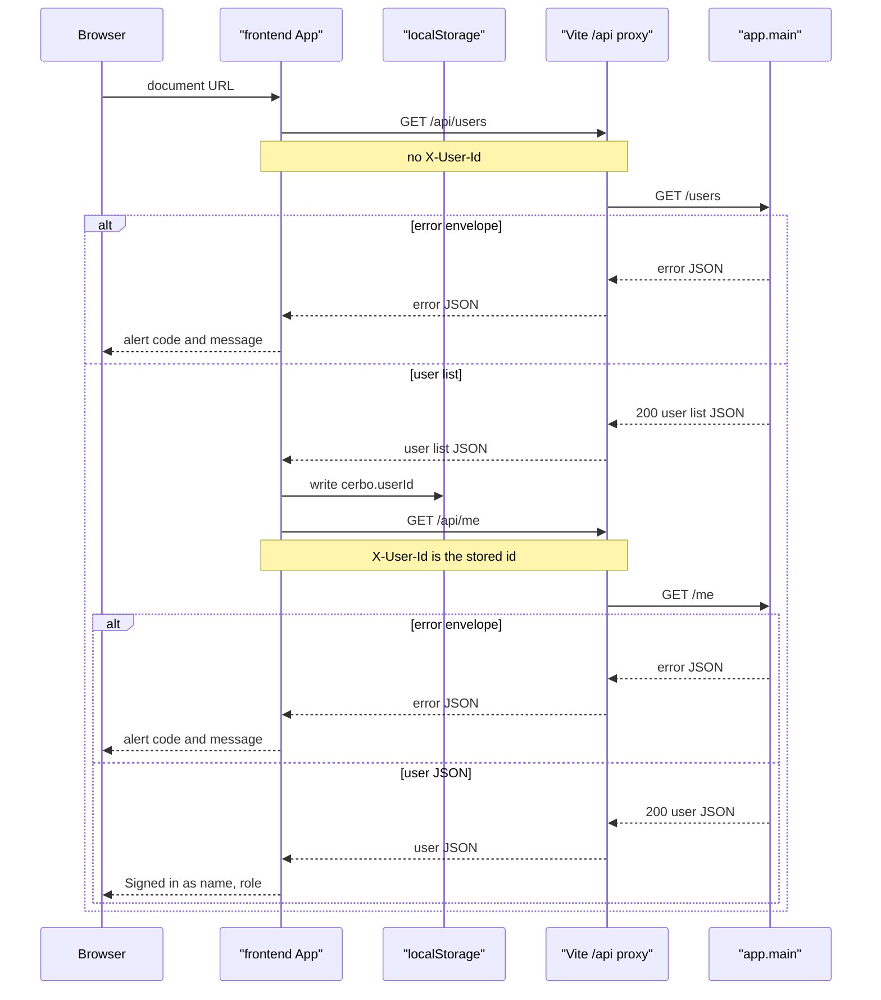
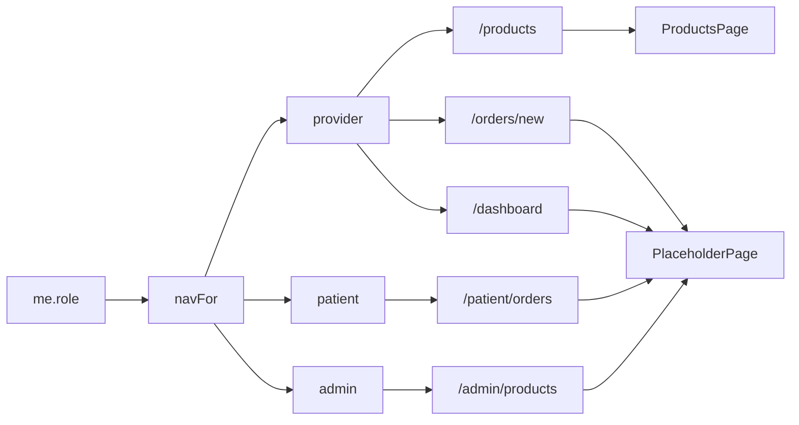
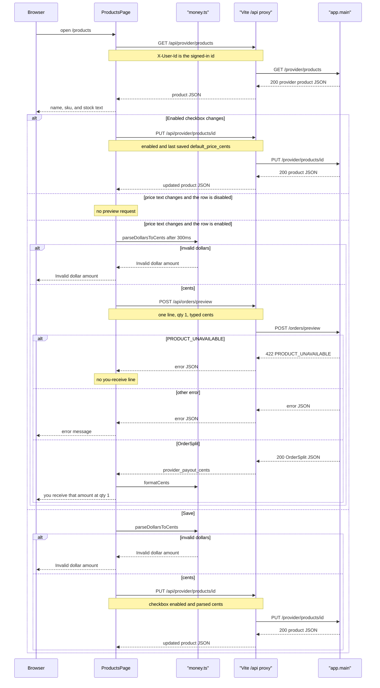
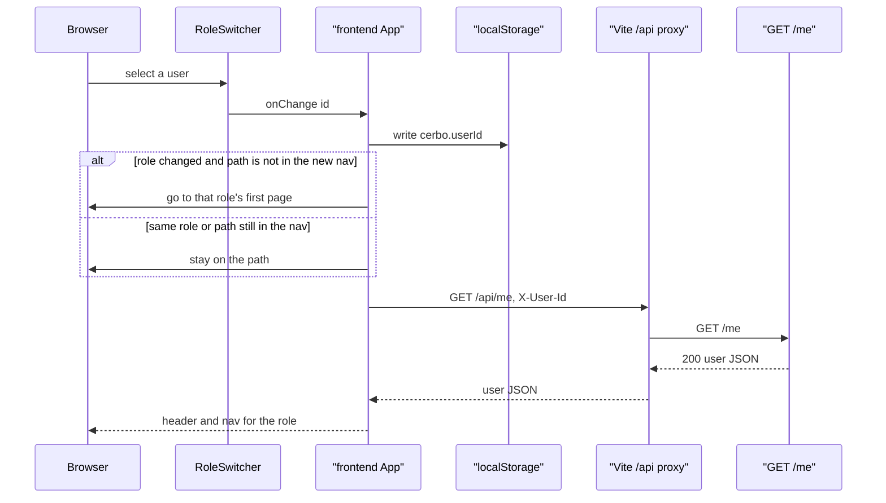

_Last updated: 2026-10-06 — T12: /products is ProductsPage, with stock, enable, price save, and preview._

# Frontend shell

`src/main.tsx` mounts `BrowserRouter`, Pico CSS, and `theme.css`, then renders `App`. `src/api/client.ts` calls relative URLs under `/api`. The Vite dev server proxies only `/api` to `http://127.0.0.1:8000` and strips the `/api` prefix. A document request such as `/orders/5` or `/products` is not proxied. It stays in the SPA. See `data-flow.md`.

## Load

`App` calls `apiGet("/users", null)` on mount. `RoleSwitcher` renders that list in a select. The stored id is `localStorage` key `cerbo.userId` when the value is digits and matches a listed user. Otherwise it is the first user. An empty list throws `Error` "No users" and does not call `GET /me`. `App` writes the chosen id, then calls `apiGet("/me", userId)`.

A response that is not OK is read as JSON. When `error.code` and `error.message` are strings and `error.line_index` is null or a number, `apiGet` throws `ApiError` with `code`, `message`, and `lineIndex`. The header alert shows `code: message`. Any other failure becomes `Error` "Request failed".

`/` renders "Loading account…" until `GET /me` returns. It then replaces the location with that role's first page.

## Role and routes

The link labels are Products, New order, Dashboard, My orders, and Stock & COGS. `/products` renders `ProductsPage` with the signed-in user id. `/orders/new`, `/dashboard`, `/patient/orders`, and `/admin/products` still render `PlaceholderPage` with that title and the signed-in name and role. Those placeholder pages do not fetch. `/orders/:orderId` and `/orders/:orderId/audit` are not registered, so those document URLs have no page. The header still renders.

## Products

`ProductsPage` calls `apiGet("/provider/products", userId)` when it mounts. The client fetches `/api/provider/products` with `X-User-Id`. The proxy strips `/api`. A failed list shows the error message and no rows. Each row shows `name`, `sku`, and stock as `{n} in stock` or `Out of stock`. Stock is not an input and is not sent back.

The checkbox PUT does not send the unsaved typed price. Turning a row off clears the you-receive line and the preview error. `PRODUCT_UNAVAILABLE` from preview is ignored: the row shows no payout and no preview error. Any other preview or save failure shows the error message. The browser does not compute the split.

The first page is `/products` for a provider, `/patient/orders` for a patient, and `/admin/products` for an admin. A role change whose current path is already in the new nav does not navigate. The redirect uses the role on the user already loaded from `GET /users`. `GET /me` then runs again because the selected id changed. A failed `GET /me` throws `ApiError` the same way as the first load.

## Dollars and generated types

`src/lib/money.ts` exports `parseDollarsToCents` and `formatCents`. `ProductsPage` calls them. `parseDollarsToCents` accepts an optional leading `$` and commas only as thousands separators, then returns integer cents. A comma that is not a thousands separator is invalid. `formatCents` prints `$` and groups thousands. Neither function computes a split. The you-receive line formats `provider_payout_cents` from `POST /orders/preview`.

`npm run gen:api` runs `openapi-typescript` against `http://127.0.0.1:8000/openapi.json` and writes `src/api/schema.ts`. `RoleSwitcher` imports `UserResponse` from that file. `ProductsPage` imports `ProviderProductResponse` and `PreviewResponse`. The running page does not request the OpenAPI document.
