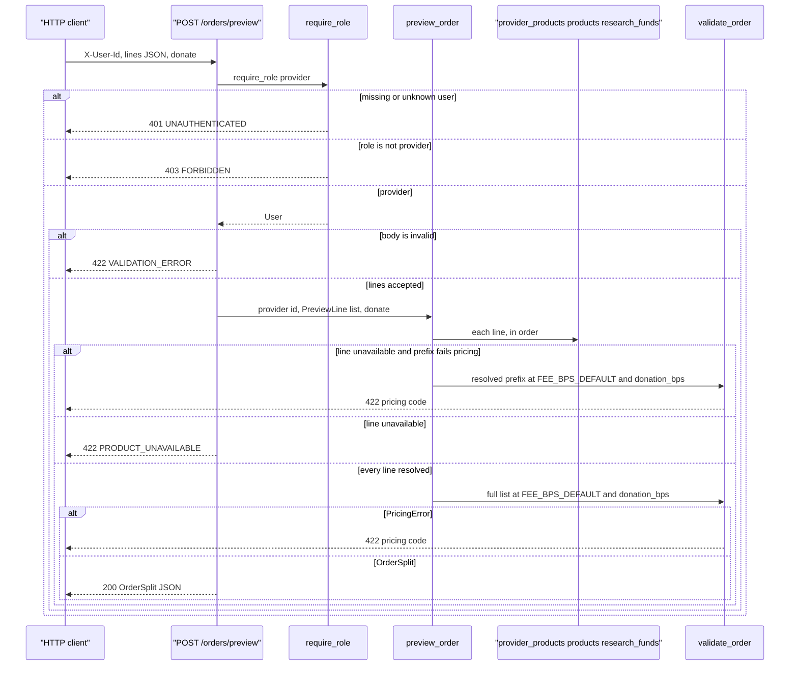

_Last updated: 2026-10-09 — T23: preview accepts donate; four-way split with donation_bps/donation_cents._

# POST /orders/preview

`api/orders.post_order_preview` depends on `require_role("provider")`, which depends on `current_user`. The body is `{"lines": [{product_id, qty, unit_price_cents}, ...], "donate": bool}` (`donate` defaults to `false`). `preview_order` reads `provider_products`, `products.unit_cogs_cents`, and the product's `research_funds` link, then calls `validate_order` at `FEE_BPS_DEFAULT` with `donation_bps` `500` when `donate` is true and `0` when false. It does not commit and does not insert, update, or delete. See `data-flow.md`.

`get_session` opens a `Session` for the request and closes it with no commit. Create, view, and cancel are in `flows/orders.md`. Pay is in `flows/pay.md`. This route still does not write.

**Body.** `PreviewRequest` and `PreviewLineRequest` are strict. `product_id`, `qty`, and `unit_price_cents` must be JSON integers. `donate` is an optional JSON boolean (default `false`). `app.main` maps `RequestValidationError` to 422 `VALIDATION_ERROR`, message "Invalid request", `line_index` null. `preview_order` does not run.

**Donation rate.** `donation_bps_for(donate)` returns `DONATION_BPS_ON` (`500`) or `DONATION_BPS_OFF` (`0`). That rate is passed into every `validate_order` call on this request, including a prefix check before `PRODUCT_UNAVAILABLE`.

**Each line.** A `product_id` outside `1..9223372036854775807` is unavailable and is not queried. Otherwise `session.get(ProviderProduct, (provider_id, product_id))` must find a row with `enabled = 1`. A missing row or `enabled = 0` does not read `products`. An enabled row loads `products`, copies `unit_cogs_cents`, sets `has_research_fund` from the linked `research_funds` row (if any), and records `stock_available` plus a fund snapshot for the response extras. A missing product is unavailable. The first unavailable line stops the walk.

**Unavailable versus pricing.** If earlier lines already resolved, `validate_order` runs on that prefix before `ProductUnavailable` is raised. A `PricingError` from the prefix is the HTTP response. If the prefix is valid, or there is no prefix, the route raises `APIError` 422 `PRODUCT_UNAVAILABLE`, message "Product is not available for this provider.", and `line_index` of the unavailable line.

**Full list.** When every line resolves, including an empty list, `validate_order` runs on the whole list at `FEE_BPS_DEFAULT` and the request's `donation_bps`. An empty list raises `EMPTY_ORDER`. `INVALID_DONATION_BPS` and `DONATION_EXCEEDS_PAYOUT` are possible when the rate or margin cannot support the donation. `PricingError` stays on the existing 422 handler: `code` is the pricing code, `message` is `detail`, and `line_index` is the error's line index.

**Four-way split.** `compute_split` floors per-line donation as `(line_margin_cents * donation_bps) // 10_000` when the product has a research fund and `donation_bps > 0`; otherwise the line donation is `0`. Order `donation_cents` is the sum of line donations. `provider_payout_cents = subtotal − cogs_total − platform_fee − donation`. The invariant is `subtotal = cogs_total + platform_fee + donation + provider_payout`.

**Out.** HTTP 200 is the `OrderSplit` plus line extras: `lines` of `{product_id, qty, unit_price_cents, unit_cogs_cents, line_total_cents, line_cogs_cents, line_margin_cents, donation_cents}` (and stock/fund fields from extras), plus `subtotal_cents`, `cogs_total_cents`, `fee_bps`, `platform_fee_cents`, `donation_bps`, `donation_cents`, and `provider_payout_cents`. No order row is created.

401 and 403 use the `APIError` envelope. The 401 message is "Missing or unknown user". The 403 message is "Wrong role".
