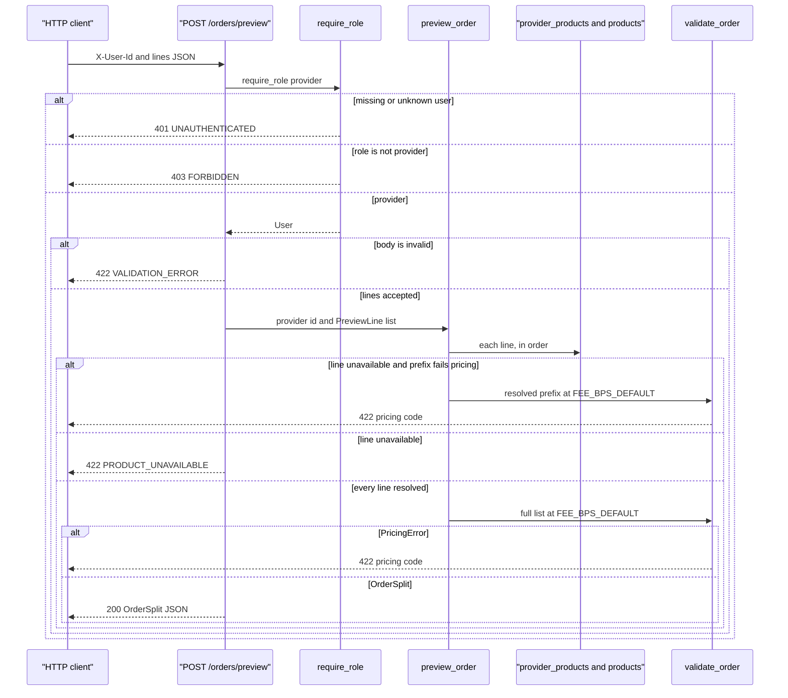

_Last updated: 2026-10-05 — T5: a provider previews a split; the route does not write._

# POST /orders/preview

`api/orders.post_order_preview` depends on `require_role("provider")`, which depends on `current_user`. The body is `{"lines": [{product_id, qty, unit_price_cents}, ...]}`. `preview_order` reads `provider_products` and `products.unit_cogs_cents`, then calls `validate_order` at `FEE_BPS_DEFAULT`. It does not commit and does not insert, update, or delete. `stock_qty` is not read. See `data-flow.md`.

`get_session` opens a `Session` for the request and closes it with no commit.

**Body.** `PreviewRequest` and `PreviewLineRequest` are strict. `product_id`, `qty`, and `unit_price_cents` must be JSON integers. `app.main` maps `RequestValidationError` to 422 `VALIDATION_ERROR`, message "Invalid request", `line_index` null. `preview_order` does not run.

**Each line.** A `product_id` outside `1..9223372036854775807` is unavailable and is not queried. Otherwise `session.get(ProviderProduct, (provider_id, product_id))` must find a row with `enabled = 1`. A missing row or `enabled = 0` does not read `products`. An enabled row loads `products` and copies `unit_cogs_cents` into a `LineInput`. A missing product is unavailable. The first unavailable line stops the walk.

**Unavailable versus pricing.** If earlier lines already resolved, `validate_order` runs on that prefix before `ProductUnavailable` is raised. A `PricingError` from the prefix is the HTTP response. If the prefix is valid, or there is no prefix, the route raises `APIError` 422 `PRODUCT_UNAVAILABLE`, message "Product is not available for this provider.", and `line_index` of the unavailable line.

**Full list.** When every line resolves, including an empty list, `validate_order` runs on the whole list at `FEE_BPS_DEFAULT`. An empty list raises `EMPTY_ORDER`. `PricingError` stays on the existing 422 handler: `code` is the pricing code, `message` is `detail`, and `line_index` is the error's line index.

**Out.** HTTP 200 is the `OrderSplit`: `lines` of `{product_id, qty, unit_price_cents, unit_cogs_cents, line_total_cents, line_cogs_cents, line_margin_cents}`, plus `subtotal_cents`, `cogs_total_cents`, `fee_bps`, `platform_fee_cents`, and `provider_payout_cents`. No order row is created.

401 and 403 use the `APIError` envelope. The 401 message is "Missing or unknown user". The 403 message is "Wrong role".
