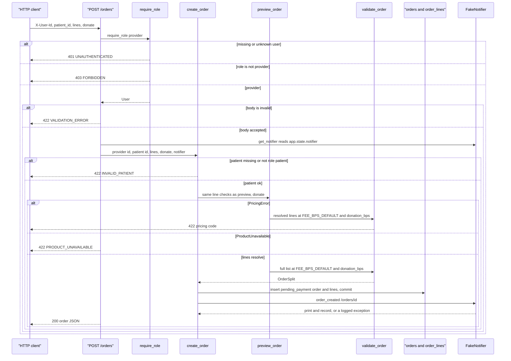
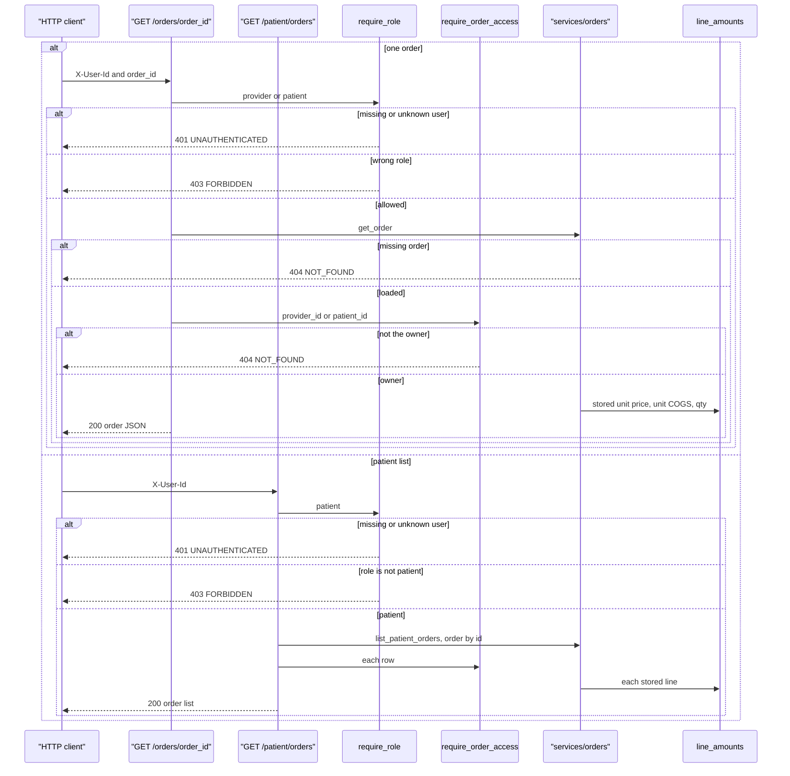
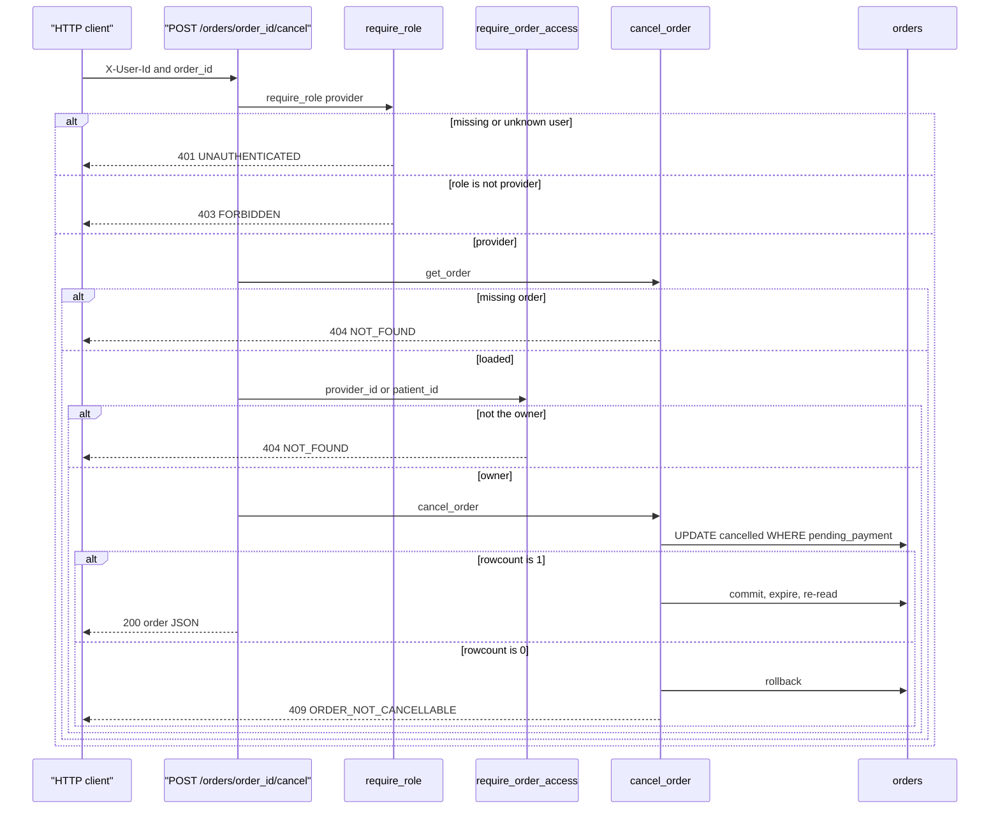

_Last updated: 2026-10-09 — T24 / D13: present_order splits lines / removed_lines; link to remove-line flow._

# Create, view, and cancel

`POST /orders/preview` accepts `donate` and does not write. See `flows/order-preview.md`. Patient soft-remove is in `flows/remove-line.md`. Pay is in `flows/pay.md`. Dashboard and audit reads are in `flows/reporting.md`. The routes below share `services/orders` and the error envelope from `app.main`. `get_session` opens a `Session` and closes it with no extra commit. `create_order`, `remove_order_line`, and `cancel_order` commit inside the service. The engine `begin` listener runs `BEGIN IMMEDIATE` on that session.

`patient_link` is always `/orders/{id}`.

## Create

`POST /orders` depends on `require_role("provider")` and `get_notifier`. The body is `{"patient_id", "lines": [{product_id, qty, unit_price_cents, ...}, ...], "donate": bool}` (`donate` defaults to `false`). `create_order` checks the patient, runs `preview_order(..., donate=donate)`, copies the four-way snapshot, commits, then calls `notifier.order_created`.

**Patient.** The id must be in `1..9223372036854775807`, and `users.role` must be `patient`. Otherwise nothing is written. The 422 message is "Patient must be a patient user."

**Price.** `preview_order` is the same function as preview, including `donate` → `donation_bps` and a pricing check of any resolved prefix before `PRODUCT_UNAVAILABLE`. `PricingError` uses the app handler: `code` is the pricing code, `message` is `detail`, `line_index` is the error's line index. `PRODUCT_UNAVAILABLE` uses message "Product is not available for this provider." A missing `products` row while copying names is the same 422 and still happens before `session.add`.

**Row.** `status` is `pending_payment`. `fee_bps`, `donation_bps`, `subtotal_cents`, `cogs_total_cents`, `platform_fee_cents`, `donation_cents`, and `provider_payout_cents` are copied from the split. Each `order_lines` row stores `product_name`, `qty`, `unit_price_cents`, `unit_cogs_cents`, `dosing`, `note`, `donation_cents`, and fund snapshots (`fund_id`, `fund_name`, `fund_url`) from the preview extras. `removed_at` is null. `payment_ref`, `paid_at`, and `cancelled_at` are null. Stock and `ledger_entries` are not touched.

**Notify.** The notifier runs only after `commit`. `FakeNotifier` prints `order created: /orders/{id}` and appends `(order.id, patient_link)`. An exception is logged. The response is still HTTP 200 for the created order.

**Out.** Stored order columns plus line totals from `line_amounts` on each stored line. Active lines are in `lines`; soft-removed lines (none at create) are in `removed_lines`. `patient_link` is `/orders/{id}`.

## View

`GET /orders/{order_id}` allows `provider` or `patient`, then `require_order_access`. `GET /patient/orders` allows `patient` and lists that patient's orders by `orders.id`. Both responses come from `present_order`. Neither route writes. An admin is 403 on both.

**One order.** A non-integer `order_id` is 422 `VALIDATION_ERROR` before `get_order`. An id outside `1..9223372036854775807`, a missing row, and a user who is neither that order's provider nor its patient are all 404 `NOT_FOUND` "Not found".

**List.** The query is `patient_id =` the caller. The route still calls `require_order_access` on each row, then presents it. No rows returns `[]`.

**Amounts.** `present_order` partitions loaded lines: `removed_at IS NULL` → `lines`, `removed_at` set → `removed_lines`. `line_amounts` returns `unit_price_cents * qty`, `unit_cogs_cents * qty`, and the difference on each. Order totals, `fee_bps`, `donation_bps`, and `donation_cents` are the stored `orders` columns. Line `donation_cents` and fund snapshots are stored on the line. The live catalog is not read. `compute_fee` is not called.

## Cancel

`POST /orders/{order_id}/cancel` depends on `require_role("provider")`, loads the order, then `require_order_access`. `cancel_order` does not read `status` in Python. It updates only a row that is still `pending_payment`.

**Update.** The statement is `UPDATE orders SET status='cancelled', cancelled_at=? WHERE id=? AND status='pending_payment'` with `synchronize_session=False`. `cancelled_at` is UTC `YYYY-MM-DDTHH:MM:SSZ`. One row commits, then `expire` and a fresh `session.get`. The 200 body is `present_order` of that row, including line totals from the stored lines. A missing row after the commit raises `OrderNotCancellable`.

**Zero rows.** `paid`, `cancelled`, or a lost race matches nothing. `cancel_order` rolls back and raises `OrderNotCancellable`. The route maps that to 409 `ORDER_NOT_CANCELLABLE`, message "Order cannot be cancelled." The committed row is left as it was.

**Unchanged.** There is no notifier call on any branch. `products.stock_qty` is unchanged. No `ledger_entries` row is inserted. `payment_ref` and `paid_at` stay as they were.
