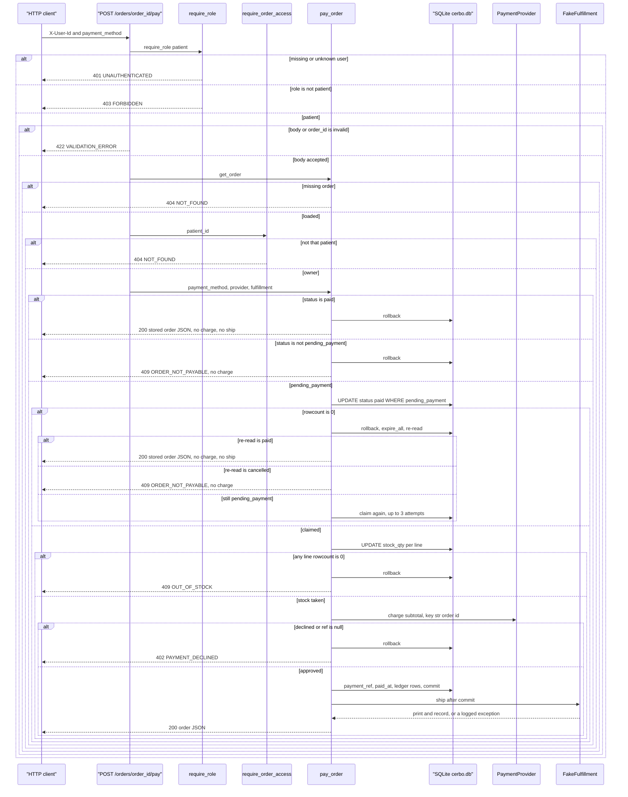

_Last updated: 2026-10-09 — T23: pay writes research_donation ledger rows per fund alongside the four base types._

# POST /orders/{order_id}/pay

`api/orders.post_pay_order` depends on `require_role("patient")`, `get_payment_provider`, and `get_fulfillment`. The body is `{"payment_method": "fake_card_ok" | "fake_card_decline"}`. `PayRequest` is strict. The route loads the order, calls `require_order_access`, then `pay_order` on that same request session.

`get_session` opens one `Session` and closes it with no extra commit. `db.make_engine` listens for `begin` and runs `BEGIN IMMEDIATE`. `pay_order` does not open another session and does not send its own `BEGIN`. The claim, stock updates, `payment_ref`, `paid_at`, and ledger inserts commit as one transaction. `fulfillment.ship` runs after that commit.

Create, view, and cancel stay in `flows/orders.md`. Dashboard and audit reads are in `flows/reporting.md`. Pay is still the only writer of `ledger_entries`.

**Auth.** A provider or an admin is 403 `FORBIDDEN` "Wrong role" before the order is loaded. A missing or unknown user is 401 `UNAUTHENTICATED`.

**Body.** `payment_method` must be the JSON string `fake_card_ok` or `fake_card_decline`. A non-integer `order_id` or any other body is 422 `VALIDATION_ERROR` before `pay_order`. Nothing is written.

**Load.** An id outside `1..9223372036854775807`, or a missing `orders` row, is 404 `NOT_FOUND` "Not found" from `get_order`. `require_order_access` then allows only that order's `patient_id`. Any other patient is the same 404. `pay_order` does not run.

**Already paid.** The first read inside `pay_order` uses the same session. `status` `paid` builds the receipt with `present_order`, rolls back, and returns. `charge` is not called. `ship` is not called. A later pay of the same order is this path.

**Not payable.** `status` other than `paid` or `pending_payment` rolls back and raises `OrderNotPayable`. The route maps that to 409 `ORDER_NOT_PAYABLE`, message "Order cannot be paid." A `cancelled` order takes this path. Nothing is charged. A row missing on this inner read is the same 409, which is a different response from the route's earlier 404.

**Claim.** For `pending_payment`, `pay_order` runs `UPDATE orders SET status='paid' WHERE id=? AND status='pending_payment'` with `synchronize_session=False`. One row continues. Zero rows rolls back, calls `expire_all`, and the next loop reads the order again on the same session. A paid re-read returns the stored receipt and does not charge or ship. A cancelled re-read is 409 and does not charge. A `pending_payment` re-read tries the claim again. The loop allows three attempts. Three lost claims end in `rollback` and 409 `ORDER_NOT_PAYABLE`.

**Stock.** After a claim, each `order_lines` row, ordered by `order_lines.id`, runs `UPDATE products SET stock_qty=stock_qty-qty WHERE id=? AND stock_qty>=qty` with `synchronize_session=False`. Any line with zero rows rolls the claim and the stock changes back and raises `OutOfStock`. The route returns 409 `OUT_OF_STOCK`, message "Not enough stock." `charge` is not called.

**Charge.** `charge(amount_cents=order.subtotal_cents, idempotency_key=str(order.id), payment_method)` runs only after every line takes stock. `fake_card_decline` returns `approved` false, `ref` null, and reason "Card declined." A result that is not approved, or whose `ref` is null, rolls back and raises `PaymentDeclined`. The route returns 402 `PAYMENT_DECLINED`, message "Payment was declined." The rollback leaves `status` `pending_payment`. `ship` is not called. `fake_card_ok` approves with `ref` `fake_{order.id}`.

**Ledger and commit.** After an approval, `pay_order` expires the order and loads it again. If that row is missing or not `paid`, it rolls back and raises `OrderNotPayable`. Otherwise it sets `payment_ref` to `charged.ref` and `paid_at` to UTC `YYYY-MM-DDTHH:MM:SSZ`, then `_write_ledger` inserts:

1. Four non-donation rows from the stored order columns (`fund_id` null): `patient_payment` = `subtotal_cents`, `cerbo_cogs` = `cogs_total_cents`, `cerbo_fee` = `platform_fee_cents`, `provider_payable` = `provider_payout_cents`.
2. One `research_donation` row per fund with a positive summed line `donation_cents`, ordered by `fund_id`, with that fund's `fund_id` set. Lines with `donation_cents` 0 are skipped. When `donation_bps` was 0 at create, there are no donation ledger rows.

Each row's `created_at` is that same `paid_at`. One `commit` writes the claim, the stock decrements, `payment_ref`, `paid_at`, and those ledger rows. Partial unique indexes allow one non-donation row per `(order_id, entry_type)` and one `research_donation` per `(order_id, fund_id)`.

**Ship.** `FakeFulfillment.ship` runs after the commit. It prints `would ship order #{id}` and appends the order id to `calls`. If `ship` raises, the service logs `fulfillment failed after order {id} was paid` and still returns the receipt. The commit is not undone. Returning an already-paid order does not ship.

**Receipt.** HTTP 200 is `present_order`, the same order JSON as `GET /orders/{order_id}`: stored order columns (including `donation_bps` and `donation_cents`), `patient_link` `/orders/{id}`, and line totals from `line_amounts` plus stored line `donation_cents` and fund snapshots. `status` is `paid`, with `paid_at` and `payment_ref` set. Ledger rows are not on the receipt. `GET /orders/{order_id}/audit` reads them. See `flows/reporting.md`.
