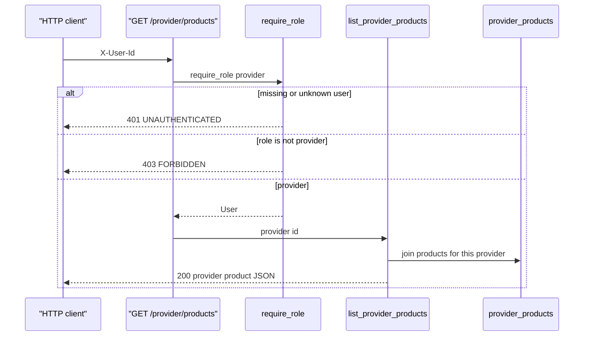
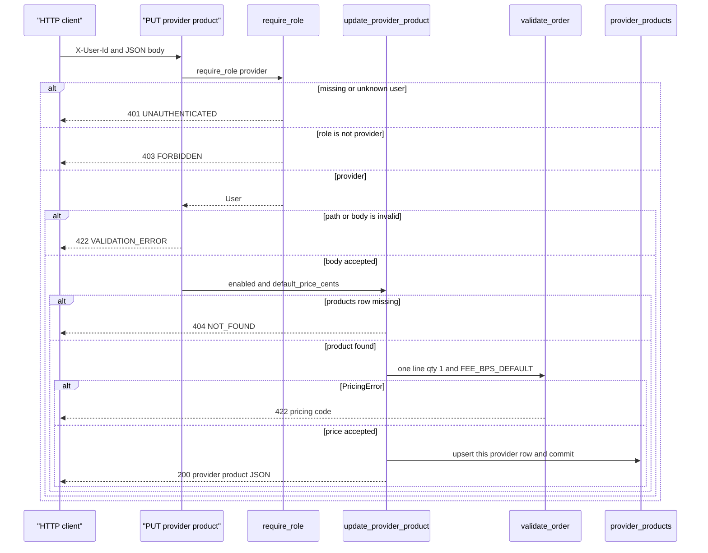

_Last updated: 2026-10-05 — T4: a provider reads their product list and updates one row._

# Provider product list

`GET /provider/products` and `PUT /provider/products/{product_id}` both depend on `require_role("provider")`, which depends on `current_user`. The shared catalog `GET /products` is a different route: provider or admin, and it reads `products` only. See `data-flow.md`.

`get_session` opens a `Session` for the request and closes it with no extra commit. The update commits inside `update_provider_product` after the price check passes.

## Read

The join is `provider_products` to `products` on `product_id`, filtered by `provider_id`, ordered by `products.id`. Each row is `{product_id, sku, name, enabled, default_price_cents, unit_cogs_cents, stock_qty}`. `stock_qty` and `unit_cogs_cents` are copied from `products`. No row is inserted or updated.

401 and 403 use the `APIError` envelope: `{"error": {"code", "message", "line_index": null}}`. The 401 message is "Missing or unknown user". The 403 message is "Wrong role".

## Update

**Body.** `ProviderProductUpdate` is strict. `enabled` must be a JSON boolean and `default_price_cents` a JSON integer. A non-integer `product_id` fails the same way. `app.main` maps `RequestValidationError` to 422 `VALIDATION_ERROR`, message "Invalid request", `line_index` null. `update_provider_product` does not run.

**Unknown product.** `session.get(Product, product_id)` misses. The route raises `APIError` 404 `NOT_FOUND` "Not found". `validate_order` does not run.

**Price.** One `LineInput`: the product id, quantity 1, the submitted `default_price_cents`, and `unit_cogs_cents` from `products`, with `FEE_BPS_DEFAULT`. `PricingError` becomes 422. `code` is the pricing code, `message` is `detail`, and `line_index` is the error's line index. The `provider_products` row is left unchanged.

**Write.** Only `(provider_id, product_id)` for the caller. A missing link is inserted; an existing link has `enabled` and `default_price_cents` replaced. `enabled` is stored as `1` or `0`. `products.stock_qty` is not updated. The 200 body matches one provider-list row, including that stock value.
