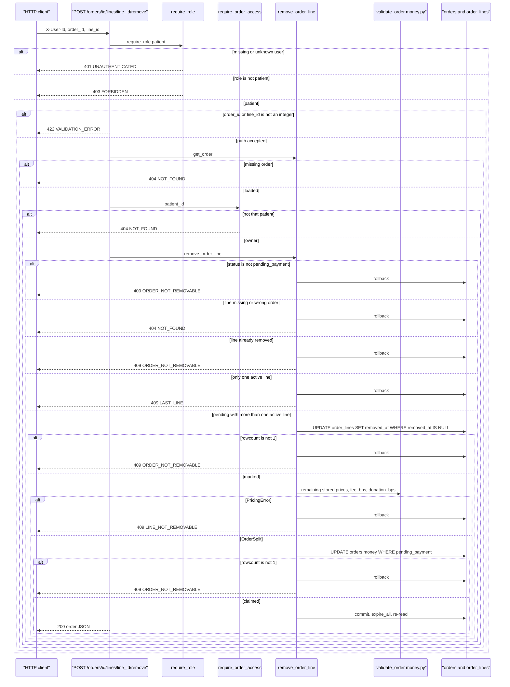

_Last updated: 2026-10-09 — T24 / D13: patient soft-removes a pending line; recompute split from remaining snapshots._

# POST /orders/{order_id}/lines/{line_id}/remove

`api/orders.post_remove_order_line` depends on `require_role("patient")`. No body. The route loads the order, calls `require_order_access`, then `remove_order_line` on that same request session.

`get_session` opens one `Session` and closes it with no extra commit. Soft-remove sets `order_lines.removed_at`, then conditionally updates the order's stored money columns from `money.py` using the remaining lines' stored prices and the order's stored `fee_bps` / `donation_bps`. One `commit` stores both. The live catalog is not read. Create, view, and cancel stay in `flows/orders.md`. Pay (active lines only for stock and ledger) is in `flows/pay.md`.

**Auth.** A provider or an admin is 403 `FORBIDDEN` "Wrong role" before the order is loaded. A missing or unknown user is 401 `UNAUTHENTICATED`.

**Path.** A non-integer `order_id` or `line_id` is 422 `VALIDATION_ERROR` before `get_order`. Nothing is written.

**Load and access.** Same `get_order` path as `GET /orders/{order_id}`, then `require_order_access`. Missing is 404 `NOT_FOUND`. A patient who is not that order's `patient_id` is the same 404. `remove_order_line` does not run.

**Status.** The service re-reads the order. Any status other than `pending_payment` (including `paid` and `cancelled`) rolls back and becomes 409 `ORDER_NOT_REMOVABLE`, message "Order cannot be changed."

**Line.** A `line_id` outside `1..9223372036854775807`, a missing `order_lines` row, or a line whose `order_id` is not this order is 404 `NOT_FOUND` "Not found". A line that already has `removed_at` set is 409 `ORDER_NOT_REMOVABLE`.

**Last line.** When `active_order_lines` has one or fewer rows (`removed_at IS NULL`), the service rolls back and raises `LastLine`. The route returns 409 `LAST_LINE`, message "At least one item must remain. Ask your provider to cancel the order."

**Soft-remove.** `UPDATE order_lines SET removed_at=? WHERE id=? AND order_id=? AND removed_at IS NULL` with `synchronize_session=False`. `removed_at` is UTC `YYYY-MM-DDTHH:MM:SSZ`. Zero rows rolls back as 409 `ORDER_NOT_REMOVABLE`. The row is not deleted.

**Recompute.** Remaining active lines become `LineInput`s from their stored `unit_price_cents`, `unit_cogs_cents`, `qty`, and whether `fund_id` is set. `validate_order` runs at the order's stored `fee_bps` and `donation_bps` (not `FEE_BPS_DEFAULT`, not a new `donate` flag, not live catalog COGS). A `PricingError` rolls back the soft-remove and becomes 409 `LINE_NOT_REMOVABLE`. On success, `UPDATE orders SET subtotal_cents, cogs_total_cents, platform_fee_cents, donation_cents, provider_payout_cents WHERE id=? AND status='pending_payment'`. `fee_bps` and `donation_bps` are not changed. Zero rows rolls back as 409 `ORDER_NOT_REMOVABLE` (remove-vs-pay / cancel race).

**Out.** HTTP 200 is `present_order`: active lines in `lines`, soft-removed lines in `removed_lines`, and the recomputed stored order totals. Pay, stock, ledger, and units sold use active lines only (`removed_at IS NULL`); see `flows/pay.md` and `flows/reporting.md`.
