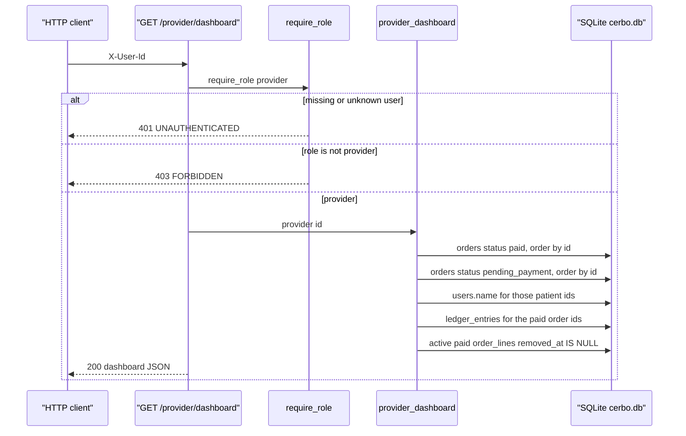
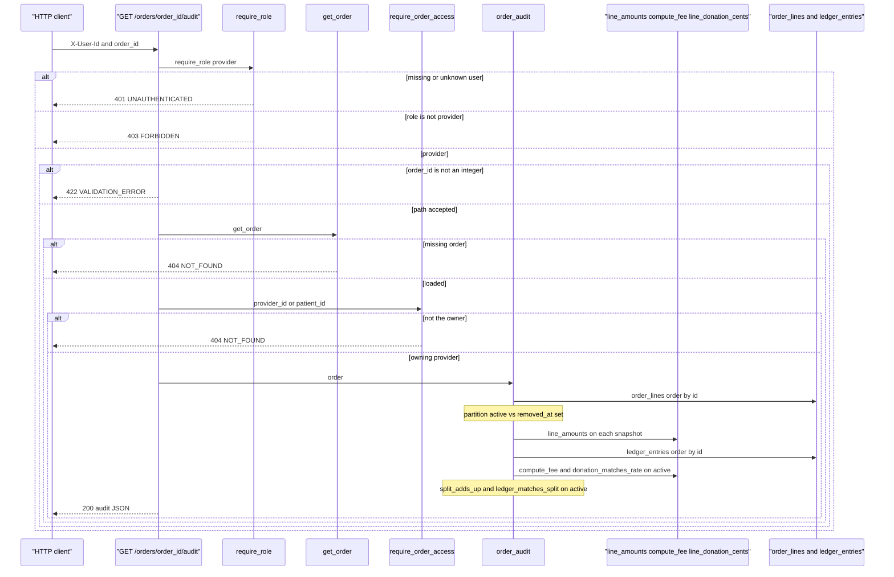

_Last updated: 2026-10-09 — T24 / D13: units_sold and audit integrity use active lines; audit lists removed_lines as Removed by patient._

# Dashboard and audit

`api/reporting` is included from `app.main` after `api/orders`. Both routes depend on `require_role("provider")` and `get_session`. `provider_dashboard` and `order_audit` do not commit and do not insert, update, or delete. The session closes with no commit.

Create, view, and cancel stay in `flows/orders.md`. Patient line removal is in `flows/remove-line.md`. Pay, which writes the base ledger rows plus any `research_donation` rows from active lines, stays in `flows/pay.md`.

## Dashboard

`GET /provider/dashboard` calls `provider_dashboard(session, user.id)`. It does not call `require_order_access`. Cancelled orders are not queried.

**Auth.** A patient or an admin is 403 `FORBIDDEN` "Wrong role". A missing or unknown user is 401 `UNAUTHENTICATED`. There is no body and no path id, so this route has no `VALIDATION_ERROR`.

**Orders.** Both queries filter `provider_id` to the caller. `paid` and `pending_payment` are loaded separately, each ordered by `orders.id`. `cancelled` is not selected. A provider with no matching rows gets empty lists and headline zeros.

**Names.** `users.name` is loaded for the distinct patient ids on those orders. Paid and pending rows use that current name.

**Headlines.** `gmv_cents` sums `patient_payment`. `platform_fee_cents` sums `cerbo_fee`. `donation_cents` sums `research_donation`. `earnings_cents` sums `provider_payable`. The query is `ledger_entries` whose `order_id` is in the paid set. `cerbo_cogs` is skipped. No paid orders returns `0, 0, 0, 0` without reading the ledger.

**Paid rows.** Each paid order copies `subtotal_cents`, `platform_fee_cents`, `donation_cents`, and `provider_payout_cents` from `orders`, not from the ledger sums. `paid_at` is the stored value, or `""` when null. `audit_link` is `/orders/{id}/audit`. Soft-removed lines are not listed on the dashboard; they appear on the audit page.

**Units.** Lines come from `order_lines` joined to `orders` with `provider_id` equal to the caller, `status` `paid`, and `OrderLine.removed_at.is_(None)`, ordered by `order_lines.id`. Soft-removed lines are excluded. `qty` is summed by `product_id`. `product_name` is the snapshot on the first active line seen for that product, which is the lowest matching `order_lines.id`. The response list is ordered by `product_id`. Pending and cancelled lines are not included.

**Pending rows.** Each `pending_payment` order contributes `id`, `created_at`, `patient_id`, and `patient_name`.

**Out.** HTTP 200 is `{gmv_cents, platform_fee_cents, donation_cents, earnings_cents, paid_orders, units_sold, pending_orders}`. Nothing is written.

## Audit

`GET /orders/{order_id}/audit` checks the provider role first, then `get_order`, then `require_order_access`, then `order_audit`. A patient and an admin are 403 before the order is loaded.

**Auth.** A patient or an admin is 403 `FORBIDDEN` "Wrong role" before `get_order`. That includes a patient who is the order's `patient_id`. A missing or unknown user is 401 `UNAUTHENTICATED`.

**Path.** A non-integer `order_id` is 422 `VALIDATION_ERROR`, message "Invalid request", `line_index` null. `get_order` does not run.

**Load.** An id outside `1..9223372036854775807`, or a missing `orders` row, raises `OrderNotFound`. The route maps that to 404 `NOT_FOUND` "Not found". `require_order_access` does not run.

**Access.** `require_order_access` allows `user.id` equal to `provider_id` or `patient_id`. Another provider is 404 `NOT_FOUND` "Not found". The body does not say which case failed. The dashboard does not use this check; the audit does, after the role check.

**Status.** The route does not filter on `status`. A `pending_payment` or `cancelled` order the provider owns is returned. Pay is what inserts ledger rows, so those unpaid orders have `ledger: []`.

**Lines.** `order_lines` for that `order_id`, ordered by `order_lines.id`. Rows with `removed_at IS NULL` go in `lines`. Rows with `removed_at` set go in `removed_lines`. `line_amounts` uses the stored `unit_price_cents`, `unit_cogs_cents`, and `qty` on each. It returns `unit_price_cents * qty`, `unit_cogs_cents * qty`, and the difference. Each audit line also copies stored `donation_cents`, `fund_id`, `fund_name`, `fund_url`, and `removed_at`. The live catalog is not read. `validate_order` is not called. The audit UI labels each `removed_lines` entry "Removed by patient" (`REMOVED_BY_PATIENT_LABEL` in `frontend/src/lib/removeLine.ts`).

**Split.** `subtotal_cents`, `cogs_total_cents`, `fee_bps`, `platform_fee_cents`, `donation_bps`, `donation_cents`, and `provider_payout_cents` are the stored `orders` columns. `id` and `status` are copied from the order.

**Ledger.** `ledger_entries` for that order, ordered by `ledger_entries.id`. Each item is `{entry_type, amount_cents, created_at, fund_id}`. A paid order has the four base rows plus zero or more `research_donation` rows. An unpaid order has none.

**Fee check.** `recomputed_fee_matches` is true when `compute_fee(subtotal_cents, fee_bps)` equals the stored `platform_fee_cents`. `compute_split` is not called.

**Donation check.** `donation_matches_rate` is true when every **active** line's stored `donation_cents` equals `line_donation_cents(margin, order.donation_bps, fund_id is not None)` and those amounts sum to `order.donation_cents`. Soft-removed lines are not included in that check.

**Split check.** `split_adds_up` is true when `subtotal_cents == cogs_total_cents + platform_fee_cents + donation_cents + provider_payout_cents` on the stored order columns.

**Ledger check.** For status `paid`, `ledger_matches_split` is true when the ledger has exactly the four non-donation entry types (amounts equal to the stored order columns, `fund_id` null, no duplicates) and the `research_donation` rows match the per-fund sums of positive **active** line `donation_cents` (one row per fund, amounts sum to `order.donation_cents`). Soft-removed lines are not summed. A repeated entry type or fund is false. For any other status, it is true only when the ledger is empty.

**Out.** HTTP 200 is `{id, status, lines, removed_lines, subtotal_cents, cogs_total_cents, fee_bps, platform_fee_cents, donation_bps, donation_cents, provider_payout_cents, ledger, recomputed_fee_matches, donation_matches_rate, split_adds_up, ledger_matches_split}`. Nothing is written.
