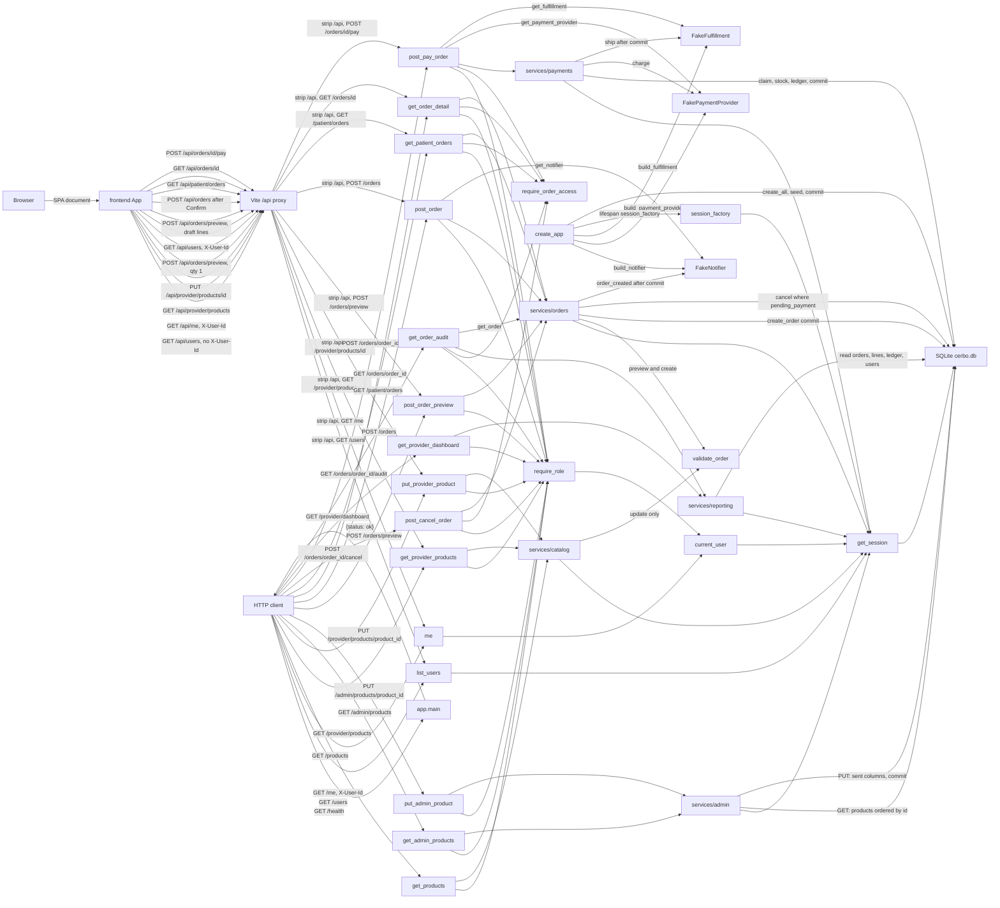

_Last updated: 2026-10-06 — T14: /patient/orders lists orders, and /orders/:orderId can pay._

# System overview

What is running after T14. The backend routes are unchanged from T10. `create_app` stores `config.build_notifier()` on `app.state.notifier`, `config.build_payment_provider()` on `app.state.payment_provider`, and `config.build_fulfillment()` on `app.state.fulfillment`, then the lifespan opens SQLite, creates the six tables, seeds, and commits. The app serves `GET /health`, `GET /users`, `GET /me`, `GET /products`, `GET /provider/products`, `PUT /provider/products/{product_id}`, `GET /admin/products`, `PUT /admin/products/{product_id}`, `POST /orders/preview`, `POST /orders`, `GET /orders/{order_id}`, `GET /patient/orders`, `POST /orders/{order_id}/cancel`, `POST /orders/{order_id}/pay`, `GET /provider/dashboard`, and `GET /orders/{order_id}/audit`. Preview does not write. Create inserts `orders` and `order_lines` and then notifies. Cancel conditionally updates a `pending_payment` order. Pay claims that order, decrements stock, calls `PaymentProvider.charge`, writes four `ledger_entries`, commits, then calls `Fulfillment.ship`. Dashboard and audit read through `services/reporting` and do not commit. `GET /admin/products` reads `products` ordered by `id` and does not commit. `PUT /admin/products/{product_id}` updates only the sent `stock_qty` and/or `unit_cogs_cents`, then commits once. The Vite app calls `GET /users` and `GET /me` through the dev server proxy for `/api`. `ProductsPage` on `/products` also calls `GET /provider/products`, `PUT /provider/products/{product_id}`, and `POST /orders/preview` through that proxy. `NewOrderPage` on `/orders/new` calls `GET /users` with `X-User-Id`, `GET /provider/products`, `POST /orders/preview`, and, only after Confirm, `POST /orders`. `PatientOrdersPage` on `/patient/orders` calls `GET /patient/orders`. `PatientOrderPage` on `/orders/:orderId` calls `GET /orders/{order_id}` and, when a patient pays a `pending_payment` order, `POST /orders/{order_id}/pay`. See `flows/frontend-shell.md`, `flows/orders.md`, `flows/pay.md`, `flows/reporting.md`, and `flows/admin-products.md`.

## Legend

- **frontend App** — Vite + React + TypeScript. `src/main.tsx` mounts `BrowserRouter`, Pico CSS, and `theme.css` around `src/App.tsx`. `src/api/client.ts` fetches relative URLs under `/api`. `apiGet` is GET. `apiSend` is POST or PUT with a JSON body. `X-User-Id` is set only when a user id is passed. `App` calls `GET /users` with no id. `NewOrderPage` calls `GET /users` with the signed-in id. The chosen id is `localStorage` key `cerbo.userId`. `GET /me` is shown in the header. Nav follows that role: provider `/products`, `/orders/new`, `/dashboard`; patient `/patient/orders`; admin `/admin/products`. `/products` renders `ProductsPage` once `GET /me` has returned. `/orders/new` is a static route and still renders `NewOrderPage` with that user id, and the route element `key` is the user id. `/patient/orders` renders `PatientOrdersPage` with that user id, and its route element `key` is the user id. `/orders/:orderId` renders `PatientOrderRoute` with that user id and role. `PatientOrderRoute` renders `PatientOrderPage` with `key` set to the order id. `/dashboard` and `/admin/products` still render `PlaceholderPage`. `/orders/:orderId/audit` is not registered. A non-OK body with the error envelope throws `ApiError` (`code`, `message`, `lineIndex`). `src/lib/money.ts` parses and formats dollars. Commas are accepted only as thousands separators. It does not compute a split. `ProductsPage` loads `GET /provider/products`, shows `stock_qty` as text, and does not send stock. The Enabled checkbox PUTs `{enabled, default_price_cents}` immediately, using the last saved cents, not the unsaved typed price. After the price text changes, and only while the row is enabled, it waits 300ms and POSTs `/orders/preview` with one line at qty 1. The you-receive line formats `provider_payout_cents` from that response. A disabled row does not call preview. Save PUTs the checkbox state and the parsed cents. `NewOrderPage` on mount calls `GET /users` and `GET /provider/products`. Patients are users whose `role` is `patient`. The product picker lists only enabled products and shows stock as `{n} in stock` or `Out of stock`. A new line uses qty 1 and `formatCents(default_price_cents)`. The page parses the typed price with `parseDollarsToCents` and does not compute the fee split. When every line has a valid qty and price, it waits 300ms and POSTs `/orders/preview` with `{lines: [{product_id, qty, unit_price_cents}]}`. It shows `subtotal_cents`, `cogs_total_cents`, `platform_fee_cents`, and `provider_payout_cents`. You receive formats `provider_payout_cents` in the `you-receive` class. Each line shows `line_total_cents`, `line_cogs_cents`, and `line_margin_cents` from the preview. An error with a numeric `line_index` is shown on that line. An error with `line_index` null is shown once for the order. Either error disables Continue. Continue also stays disabled until a patient is selected and the returned preview matches the current lines. When Continue is disabled, the page shows one short reason: Pick a patient, Add at least one item, Fix the errors above, or Checking prices. Continue switches to review on `/orders/new` and does not POST. A failed preview does not change the step. On the review step it stays on review and shows the error. Review shows the patient, each line's qty, unit price, line total, COGS, and margin, and the breakdown labeled Patient pays, COGS, Platform fee, and You receive. Confirm POSTs `/orders` with `{patient_id, lines}` taken from the preview lines. Back returns to the builder and does not create an order. Success shows Order created, the patient name, and `patient_link` from the response. Copy calls `navigator.clipboard.writeText` with that link. `PatientOrdersPage` calls `GET /patient/orders` and lists each order with a status label and `formatCents(subtotal_cents)`, linking to `/orders/{id}`. An empty list says No orders. `PatientOrderPage` calls `GET /orders/{order_id}`. A path that is not all digits shows Not found and does not fetch. A patient with status `pending_payment` can POST `/orders/{id}/pay` with `payment_method` `fake_card_ok` or `fake_card_decline`. Pay is disabled while that request is in flight. A paid order renders heading Receipt and status Paid, and hides Pay. The page shows Prices set by your provider on {Mon D} from the UTC date prefix of `created_at`. It formats stored cents and does not compute the split. `npm run gen:api` writes `src/api/schema.ts` from `http://127.0.0.1:8000/openapi.json`. See `flows/frontend-shell.md`.
- **app.main** — `create_app` builds a FastAPI app (`title="Cerbo supplement ordering"`). `GET /health` → `health()` returns `{"status": "ok"}` with no auth and no database read. The app includes `api/users`, `api/catalog`, `api/admin`, `api/orders`, then `api/reporting`. Three handlers share the error envelope `{"error": {"code", "message", "line_index"}}`: `APIError` (status from the error), `PricingError` (422, `message` is `detail`), and `RequestValidationError` (422 `VALIDATION_ERROR`, message "Invalid request", `line_index` null).
- **Vite /api proxy** — the Vite dev server proxies only `/api` to `http://127.0.0.1:8000` and strips the `/api` prefix. A document request such as `/orders/5` or `/products` is not proxied. It stays in the SPA.
- **HTTP client** — a direct caller of the API. Callers in the repo tests are pytest `TestClient`. The browser reaches `GET /users` and `GET /me` through the Vite proxy above. From `ProductsPage` it also reaches `GET /provider/products`, `PUT /provider/products/{product_id}`, and `POST /orders/preview`. From `NewOrderPage` it also reaches `GET /users` with `X-User-Id`, `GET /provider/products`, `POST /orders/preview`, and `POST /orders`. From `PatientOrdersPage` it reaches `GET /patient/orders`. From `PatientOrderPage` it reaches `GET /orders/{order_id}` and `POST /orders/{order_id}/pay`. The browser does not call cancel, the dashboard, audit, the admin product routes, `GET /health`, or `GET /products`.
- **list_users** — `GET /users` has no auth. It opens a session and returns every `users` row as `[{id, name, role}]`, ordered by `id`.
- **me / current_user** — `GET /me` depends on `seams/auth.current_user`, which reads header `X-User-Id` and loads `users` by id. A resolved user is returned as `{id, name, role}`. A missing header, a blank header, a non-ASCII-digit header, an id above the signed 64-bit maximum, or an unknown id becomes 401 `UNAUTHENTICATED`. See `flows/auth.md`.
- **require_role** — depends on `current_user`. A role outside the allowed set raises 403 `FORBIDDEN` "Wrong role". `GET /products` allows `provider` and `admin`. `GET /provider/products`, `PUT /provider/products/{product_id}`, `POST /orders/preview`, `POST /orders`, `POST /orders/{order_id}/cancel`, `GET /provider/dashboard`, and `GET /orders/{order_id}/audit` allow `provider` only. `GET /orders/{order_id}` allows `provider` and `patient`. `GET /patient/orders` and `POST /orders/{order_id}/pay` allow `patient` only. `GET /admin/products` and `PUT /admin/products/{product_id}` allow `admin` only.
- **services/catalog** — `list_products` reads `products` ordered by `id`. `list_provider_products` joins that provider's `provider_products` rows to `products`. `update_provider_product` loads one `products` row, calls `validate_order` with one line at quantity 1 and `FEE_BPS_DEFAULT`, then upserts only that provider's `provider_products` row (`enabled`, `default_price_cents`) and commits. Stock stays on `products`. See `flows/provider-products.md`.
- **services/admin** — `list_admin_products` reads `products` ordered by `id` and does not commit. The JSON fields are `id`, `sku`, `name`, `unit_cogs_cents`, `suggested_price_cents`, and `stock_qty`. `update_admin_product` accepts `stock_qty` and/or `unit_cogs_cents`. An omitted field is not written. The `UPDATE` sets only the sent columns with `synchronize_session=False`, then one `commit`. It does not change `sku`, `name`, `suggested_price_cents`, `provider_products`, `orders`, `order_lines`, or `ledger_entries`. An id outside `1..9223372036854775807`, or a missing row, is 404 `NOT_FOUND`. `stock_qty` below 0, `unit_cogs_cents` below 1, an empty body, a non-integer, or a value above that maximum is 422 `VALIDATION_ERROR` before any update. A provider or a patient is 403. Existing `order_lines.unit_cogs_cents` stay snapshotted. A later preview reads the new catalog COGS. See `flows/admin-products.md`.
- **services/orders** — `preview_order` does not commit and does not insert, update, or delete. `create_order` checks the patient, calls `preview_order`, copies the snapshot onto a new `orders` row and `order_lines`, commits once, then calls `notifier.order_created`. `get_order`, `list_patient_orders`, and `present_order` read stored rows. `GET /orders/{order_id}/audit` calls `get_order` before `order_audit`. `cancel_order` runs `UPDATE orders SET status='cancelled', cancelled_at=? WHERE id=? AND status='pending_payment'` with `synchronize_session=False`. Zero rows rolls back and becomes 409 `ORDER_NOT_CANCELLABLE`. Create and cancel do not change `products.stock_qty` or insert `ledger_entries`. See `flows/order-preview.md` and `flows/orders.md`.
- **services/payments** — `pay_order` uses the request session. The engine `begin` listener already issues `BEGIN IMMEDIATE`. An order that is already `paid` returns the stored receipt with no charge and no ship. `cancelled` is 409 `ORDER_NOT_PAYABLE` with no charge. A `pending_payment` order is claimed with `UPDATE orders SET status='paid' WHERE id=? AND status='pending_payment'`. Stock is then decremented per line. `PaymentProvider.charge` runs before commit. A decline rolls back. Success sets `payment_ref` and `paid_at`, inserts four `ledger_entries`, commits, then calls `fulfillment.ship`. A ship exception is logged and the receipt is still returned. See `flows/pay.md`.
- **services/reporting** — `provider_dashboard` and `order_audit` read on the request session and do not commit. The dashboard is scoped to the caller's `provider_id`. Headline totals sum `ledger_entries` on that provider's `paid` orders only: `patient_payment` is `gmv_cents`, `cerbo_fee` is `platform_fee_cents`, `provider_payable` is `earnings_cents`. `cerbo_cogs` is not summed. Paid-order rows copy `orders` money columns, current `users.name`, and `audit_link` `/orders/{id}/audit`. `units_sold` sums `qty` on `paid` `order_lines`, grouped by `product_id`, with `product_name` from the lowest `order_lines.id`. `pending_orders` are `pending_payment` only. `cancelled` orders are absent from every list and from the totals. The audit loads lines and ledger for one order the provider already passed access for. Line display amounts come from `line_amounts` on the stored snapshot. The split is the stored order columns. Ledger rows are ordered by `ledger_entries.id` and are empty when pay has not written them. `recomputed_fee_matches` is `compute_fee(subtotal_cents, fee_bps) == platform_fee_cents`. `split_adds_up` is true when `subtotal_cents == cogs_total_cents + platform_fee_cents + provider_payout_cents`. For status `paid`, `ledger_matches_split` is true when the ledger has exactly `patient_payment`, `cerbo_cogs`, `cerbo_fee`, and `provider_payable`, with amounts equal to `subtotal_cents`, `cogs_total_cents`, `platform_fee_cents`, and `provider_payout_cents`. A repeated entry type is false. For any other status, `ledger_matches_split` is true only when the ledger is empty. See `flows/reporting.md`.
- **create_app** — Calls `build_notifier()`, `build_payment_provider()`, and `build_fulfillment()` and stores them on `app.state` before the lifespan. Each `build_*` function in `app.config` is the only production constructor for that stub. The lifespan still runs `make_engine`, `init_db` (`create_all`), `seed`, `commit`, and `make_session_factory`. Shutdown calls `engine.dispose()`. The default URL is `sqlite:///./cerbo.db`. `validate_order` still calls `compute_split`, which calls `compute_fee`; that chain is drawn in `flows/order-preview.md`.
- **FakeNotifier** — `seams/notifier.py`. `order_created` prints `order created: {patient_link}` and appends `(order.id, patient_link)` to `calls`. `post_order` reads the app instance through `get_notifier` on each request and passes it to `create_order`. The call happens only after the order commit. A notifier exception is logged; the created order is still returned. Preview, get, list, cancel, pay, dashboard, audit, and the admin product routes do not call it.
- **FakePaymentProvider** — `seams/payment_provider.py`, behind the `PaymentProvider` protocol. `post_pay_order` reads it through `get_payment_provider` and `pay_order` calls `charge(amount_cents, idempotency_key, payment_method)`. The amount is the stored `subtotal_cents` and the key is `str(order.id)`. `charge` returns a frozen `ChargeResult` (`approved`, `ref`, `decline_reason`). `fake_card_decline` declines with `ref` None and reason "Card declined." Any other method approves with `ref` `fake_{idempotency_key}`. The route only accepts `fake_card_ok` or `fake_card_decline`. The same key, amount, and method replays the stored result and does not increment `charge_count`. An approval stays sticky. A stored decline plus a different method, or the same method with a different amount, is a new attempt. There is no lock. An already-paid order returns before `charge`.
- **FakeFulfillment** — `seams/fulfillment.py`, behind the `Fulfillment` protocol. `build_fulfillment` is the only constructor. `post_pay_order` reads `app.state.fulfillment` through `get_fulfillment`. `ship(order)` prints `would ship order #{id}` and appends the order id to `calls`. `pay_order` calls it only after the payment commit. An exception is logged and the receipt is still returned. A replay of an already-paid order does not call `ship`.
- **get_session** — request dependency. It opens a `Session` from `app.state.session_factory` and closes it without committing. `update_provider_product`, `update_admin_product`, `create_order`, `cancel_order`, and `pay_order` commit inside the service. `pay_order` also rolls back on the no-charge paths. `update_admin_product` rolls back when the product row is missing. `preview_order`, the order reads, `list_admin_products`, and `services/reporting` only use the session. `make_engine` listens for `begin` and runs `BEGIN IMMEDIATE` on that connection.
- **SQLite cerbo.db** — the six STRICT tables in `app.models`: `users`, `products`, `provider_products`, `orders`, `order_lines`, `ledger_entries`. Startup seed commits the four users (Dr. Maya Patel, Jane Doe, Sam Lee, Cerbo Admin), products MAG-GLY, D3-K2, OMEGA3, and PROBIO50, and Dr. Patel's four enabled `provider_products`. Seed leaves `orders`, `order_lines`, and `ledger_entries` empty. `create_order` later inserts `orders` and `order_lines`. `pay_order` decrements `products.stock_qty`, sets `payment_ref` and `paid_at`, and inserts four `ledger_entries` rows. `update_admin_product` can set `products.stock_qty` and/or `products.unit_cogs_cents`. It does not change `order_lines.unit_cogs_cents`. `services/reporting` reads `orders`, `order_lines`, `ledger_entries`, and `users` and does not write. See `data-model.md`.
- **require_order_access** — returns `None` when `user.id` is the order's `provider_id` or `patient_id`. Otherwise it raises 404 `NOT_FOUND` "Not found". `GET /orders/{order_id}`, `POST /orders/{order_id}/cancel`, `POST /orders/{order_id}/pay`, and `GET /orders/{order_id}/audit` call it after loading the order. `GET /patient/orders` calls it for each listed row. A missing order is 404 from `get_order` before this check. `POST /orders`, `POST /orders/preview`, and `GET /provider/dashboard` do not call it. Pay's role check allows only `patient`, so a provider is 403 before this check. Audit's role check allows only `provider`, so a patient or an admin is 403 before this check. Another provider is 404.
- **validate_order** — `domain/money.py`. A provider-product update calls it with one `LineInput` (`qty` 1, the submitted price, the product's `unit_cogs_cents`) and `FEE_BPS_DEFAULT`. `preview_order` calls it the same way, including a prefix when a later line is unavailable. `create_order` reaches it only through `preview_order`. Pay does not call it. Dashboard and audit do not call it. A `PricingError` becomes HTTP 422. On create, that happens before any insert. `order_audit` calls `compute_fee` and `line_amounts` directly.
- **Not drawn** — the shell sequence is in `flows/frontend-shell.md`. The admin product sequence is in `flows/admin-products.md`. Dashboard and audit reads are in `flows/reporting.md`. `present_order` uses `line_amounts` on the stored line; that read path is in `flows/orders.md`. The pay receipt is that same order JSON. Ledger rows are not on it. Tests are not a runtime component. `parseDollarsToCents` and `formatCents` run in the browser on `/products` before a preview or a price save, and on `/orders/new` before a line preview or create. `PatientOrdersPage` and `PatientOrderPage` call `formatCents` on stored cents. None of those pages compute a split. Those page sequences are in `flows/frontend-shell.md`. The pay service sequence stays in `flows/pay.md`.
