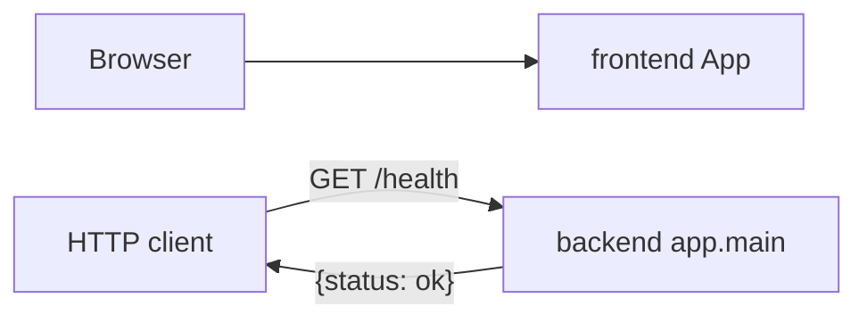

_Last updated: 2026-10-05 — T0: FastAPI GET /health and a static React heading, unconnected._

# System overview

What is running after T0. Later modules described in `docs/architecture.md` (database, domain, services, auth, catalog, orders) are not in the code yet.

## Legend

- **frontend App** — Vite + React + TypeScript. `src/main.tsx` mounts `src/App.tsx`, which renders the heading "Cerbo supplement ordering". No fetch client and no call to the backend.
- **backend app.main** — FastAPI app (`title="Cerbo supplement ordering"`) with one route: `GET /health` → `health()`, which returns `{"status": "ok"}`.
- **HTTP client** — anything that calls the API. The only caller in the repo is `backend/tests/test_health.py` via `TestClient`. The frontend is not a client of this route.
- **Not in the diagram** — no database, models, auth, or other routes. SQLAlchemy, Pydantic, and Hypothesis are declared dependencies and are unused by application code.
