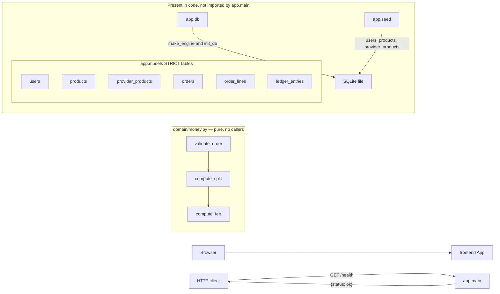

_Last updated: 2026-10-05 — T2: SQLite schema and seed exist; app.main does not open them._

# System overview

What is running after T2. `app.main` still serves only `GET /health`. The SQLite schema, engine helpers, and seed exist in code and are not imported by the app. `domain/money.py` stays pure and unconnected.

## Legend

- **frontend App** — Vite + React + TypeScript. `src/main.tsx` mounts `src/App.tsx`, which renders the heading "Cerbo supplement ordering". No fetch client and no call to the backend.
- **app.main** — FastAPI app (`title="Cerbo supplement ordering"`) with one route: `GET /health` → `health()`, which returns `{"status": "ok"}`. It does not import `app.db`, `app.models`, `app.seed`, or `domain/money.py`. No database file is opened at startup.
- **HTTP client** — anything that calls the API. The only caller in the repo is `backend/tests/test_health.py` via `TestClient`. The frontend is not a client of this route.
- **domain/money.py** — pure Python in `backend/app/domain/money.py`. Imports only `collections.abc` and `dataclasses`. `validate_order` calls `compute_split`, which calls `compute_fee`. No edge to `app.main` or to the database layer.
- **app.db** — `make_engine` opens a SQLite URL (`check_same_thread=False`), sets `isolation_level` to `None`, runs `PRAGMA foreign_keys=ON` and `PRAGMA busy_timeout=5000` on connect, and issues `BEGIN IMMEDIATE` on the begin event. `init_db` calls `Base.metadata.create_all`. `make_session_factory` binds a `sessionmaker` (`expire_on_commit=False`). Nothing in the running app calls these.
- **app.models** — STRICT tables `users`, `products`, `provider_products`, `orders`, `order_lines`, `ledger_entries`. Classes `User`, `Product`, `ProviderProduct`, `Order`, `OrderLine`, `LedgerEntry`. Money columns are integers. See `data-model.md`.
- **app.seed** — `seed(session)` inserts Dr. Maya Patel (provider), Jane Doe and Sam Lee (patients), Cerbo Admin (admin), products MAG-GLY, D3-K2, OMEGA3, and PROBIO50, and Dr. Patel's four enabled `provider_products` at suggested prices. Idempotent. Does not commit. Does not create tables. Does not write `orders`, `order_lines`, or `ledger_entries`.
- **SQLite file** — opened only when a caller passes a URL to `make_engine`. Tests use a temp file. There is no startup database file.
- **Not in the diagram** — no services, auth, catalog API, order API, or payment. Tests are not a runtime component.
