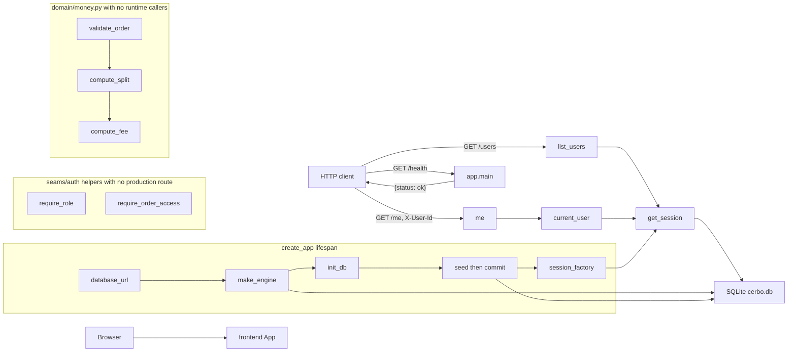

_Last updated: 2026-10-05 — T3: lifespan opens SQLite, seeds it, and serves GET /users and GET /me._

# System overview

What is running after T3. `create_app` opens SQLite on startup, creates the six tables, seeds and commits, and serves `GET /health`, `GET /users`, and `GET /me`. `domain/money.py` stays pure and has no runtime callers.

## Legend

- **frontend App** — Vite + React + TypeScript. `src/main.tsx` mounts `src/App.tsx`, which renders the heading "Cerbo supplement ordering". It has no fetch client and does not call the backend.
- **app.main** — `create_app` builds a FastAPI app (`title="Cerbo supplement ordering"`). `GET /health` → `health()` returns `{"status": "ok"}` with no auth and no database read. The app includes `api/users` and registers an `APIError` handler that returns `{"error": {"code", "message", "line_index"}}`.
- **HTTP client** — anything that calls the API. Callers in the repo are pytest `TestClient` tests. The frontend is not a client of these routes.
- **list_users** — `GET /users` has no auth. It opens a session and returns every `users` row as `[{id, name, role}]`, ordered by `id`.
- **me / current_user** — `GET /me` depends on `seams/auth.current_user`, which reads header `X-User-Id` and loads `users` by id. A resolved user is returned as `{id, name, role}`. A missing header, a blank header, a non-ASCII-digit header, an id above the signed 64-bit maximum, or an unknown id becomes 401 `UNAUTHENTICATED`. See `flows/auth.md`.
- **lifespan** — On startup, `make_engine(app.state.database_url)` opens SQLite (`check_same_thread=False`, `PRAGMA foreign_keys=ON`, `PRAGMA busy_timeout=5000`, `BEGIN IMMEDIATE` on begin). `init_db` runs `create_all`. `seed()` stages missing rows and the lifespan commits. `make_session_factory` is stored on `app.state.session_factory`. Shutdown calls `engine.dispose()`. The default URL is `sqlite:///./cerbo.db` from `app.config`; `create_app(database_url=...)` can override it.
- **get_session** — request dependency. It opens a `Session` from `app.state.session_factory` and closes it without committing.
- **SQLite cerbo.db** — the six STRICT tables in `app.models`: `users`, `products`, `provider_products`, `orders`, `order_lines`, `ledger_entries`. Startup seed commits the four users (Dr. Maya Patel, Jane Doe, Sam Lee, Cerbo Admin), products MAG-GLY, D3-K2, OMEGA3, and PROBIO50, and Dr. Patel's four enabled `provider_products`. It leaves `orders`, `order_lines`, and `ledger_entries` empty. See `data-model.md`.
- **require_role** — depends on `current_user`. A role outside the allowed set raises 403 `FORBIDDEN` "Wrong role". No production route depends on it.
- **require_order_access** — returns `None` when `user.id` is the order's `provider_id` or `patient_id`. Otherwise it raises 404 `NOT_FOUND` "Not found". No production route calls it.
- **domain/money.py** — pure Python. `validate_order` calls `compute_split`, which calls `compute_fee`. No edge to `app.main` or to the database.
- **Not drawn** — catalog, order, and payment routes are absent. Tests are not a runtime component.
