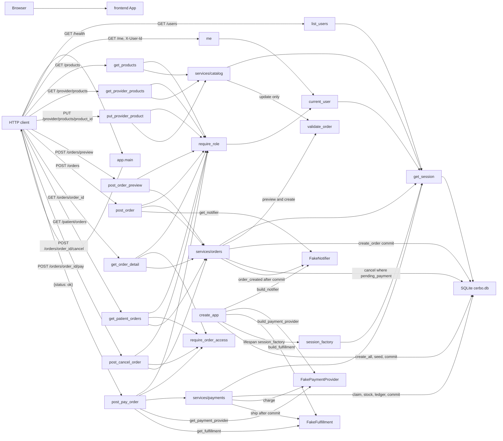

_Last updated: 2026-10-05 — T8: pay claims, charges, writes the ledger, then ships._

# System overview

What is running after T8. `create_app` stores `config.build_notifier()` on `app.state.notifier`, `config.build_payment_provider()` on `app.state.payment_provider`, and `config.build_fulfillment()` on `app.state.fulfillment`, then the lifespan opens SQLite, creates the six tables, seeds, and commits. The app serves `GET /health`, `GET /users`, `GET /me`, `GET /products`, `GET /provider/products`, `PUT /provider/products/{product_id}`, `POST /orders/preview`, `POST /orders`, `GET /orders/{order_id}`, `GET /patient/orders`, `POST /orders/{order_id}/cancel`, and `POST /orders/{order_id}/pay`. Preview does not write. Create inserts `orders` and `order_lines` and then notifies. Cancel conditionally updates a `pending_payment` order. Pay claims that order, decrements stock, calls `PaymentProvider.charge`, writes four `ledger_entries`, commits, then calls `Fulfillment.ship`. See `flows/orders.md` and `flows/pay.md`.

## Legend

- **frontend App** — Vite + React + TypeScript. `src/main.tsx` mounts `src/App.tsx`, which renders the heading "Cerbo supplement ordering". It has no fetch client and does not call the backend.
- **app.main** — `create_app` builds a FastAPI app (`title="Cerbo supplement ordering"`). `GET /health` → `health()` returns `{"status": "ok"}` with no auth and no database read. The app includes `api/users`, `api/catalog`, and `api/orders`. Three handlers share the error envelope `{"error": {"code", "message", "line_index"}}`: `APIError` (status from the error), `PricingError` (422, `message` is `detail`), and `RequestValidationError` (422 `VALIDATION_ERROR`, message "Invalid request", `line_index` null).
- **HTTP client** — anything that calls the API. Callers in the repo are pytest `TestClient` tests. The frontend is not a client of these routes.
- **list_users** — `GET /users` has no auth. It opens a session and returns every `users` row as `[{id, name, role}]`, ordered by `id`.
- **me / current_user** — `GET /me` depends on `seams/auth.current_user`, which reads header `X-User-Id` and loads `users` by id. A resolved user is returned as `{id, name, role}`. A missing header, a blank header, a non-ASCII-digit header, an id above the signed 64-bit maximum, or an unknown id becomes 401 `UNAUTHENTICATED`. See `flows/auth.md`.
- **require_role** — depends on `current_user`. A role outside the allowed set raises 403 `FORBIDDEN` "Wrong role". `GET /products` allows `provider` and `admin`. `GET /provider/products`, `PUT /provider/products/{product_id}`, `POST /orders/preview`, `POST /orders`, and `POST /orders/{order_id}/cancel` allow `provider` only. `GET /orders/{order_id}` allows `provider` and `patient`. `GET /patient/orders` and `POST /orders/{order_id}/pay` allow `patient` only.
- **services/catalog** — `list_products` reads `products` ordered by `id`. `list_provider_products` joins that provider's `provider_products` rows to `products`. `update_provider_product` loads one `products` row, calls `validate_order` with one line at quantity 1 and `FEE_BPS_DEFAULT`, then upserts only that provider's `provider_products` row (`enabled`, `default_price_cents`) and commits. Stock stays on `products`. See `flows/provider-products.md`.
- **services/orders** — `preview_order` does not commit and does not insert, update, or delete. `create_order` checks the patient, calls `preview_order`, copies the snapshot onto a new `orders` row and `order_lines`, commits once, then calls `notifier.order_created`. `get_order`, `list_patient_orders`, and `present_order` read stored rows. `cancel_order` runs `UPDATE orders SET status='cancelled', cancelled_at=? WHERE id=? AND status='pending_payment'` with `synchronize_session=False`. Zero rows rolls back and becomes 409 `ORDER_NOT_CANCELLABLE`. Create and cancel do not change `products.stock_qty` or insert `ledger_entries`. See `flows/order-preview.md` and `flows/orders.md`.
- **services/payments** — `pay_order` uses the request session. The engine `begin` listener already issues `BEGIN IMMEDIATE`. An order that is already `paid` returns the stored receipt with no charge and no ship. `cancelled` is 409 `ORDER_NOT_PAYABLE` with no charge. A `pending_payment` order is claimed with `UPDATE orders SET status='paid' WHERE id=? AND status='pending_payment'`. Stock is then decremented per line. `PaymentProvider.charge` runs before commit. A decline rolls back. Success sets `payment_ref` and `paid_at`, inserts four `ledger_entries`, commits, then calls `fulfillment.ship`. A ship exception is logged and the receipt is still returned. See `flows/pay.md`.
- **create_app** — Calls `build_notifier()`, `build_payment_provider()`, and `build_fulfillment()` and stores them on `app.state` before the lifespan. Each `build_*` function in `app.config` is the only production constructor for that stub. The lifespan still runs `make_engine`, `init_db` (`create_all`), `seed`, `commit`, and `make_session_factory`. Shutdown calls `engine.dispose()`. The default URL is `sqlite:///./cerbo.db`. `validate_order` still calls `compute_split`, which calls `compute_fee`; that chain is drawn in `flows/order-preview.md`.
- **FakeNotifier** — `seams/notifier.py`. `order_created` prints `order created: {patient_link}` and appends `(order.id, patient_link)` to `calls`. `post_order` reads the app instance through `get_notifier` on each request and passes it to `create_order`. The call happens only after the order commit. A notifier exception is logged; the created order is still returned. Preview, get, list, cancel, and pay do not call it.
- **FakePaymentProvider** — `seams/payment_provider.py`, behind the `PaymentProvider` protocol. `post_pay_order` reads it through `get_payment_provider` and `pay_order` calls `charge(amount_cents, idempotency_key, payment_method)`. The amount is the stored `subtotal_cents` and the key is `str(order.id)`. `charge` returns a frozen `ChargeResult` (`approved`, `ref`, `decline_reason`). `fake_card_decline` declines with `ref` None and reason "Card declined." Any other method approves with `ref` `fake_{idempotency_key}`. The route only accepts `fake_card_ok` or `fake_card_decline`. The same key, amount, and method replays the stored result and does not increment `charge_count`. An approval stays sticky. A stored decline plus a different method, or the same method with a different amount, is a new attempt. There is no lock. An already-paid order returns before `charge`.
- **FakeFulfillment** — `seams/fulfillment.py`, behind the `Fulfillment` protocol. `build_fulfillment` is the only constructor. `post_pay_order` reads `app.state.fulfillment` through `get_fulfillment`. `ship(order)` prints `would ship order #{id}` and appends the order id to `calls`. `pay_order` calls it only after the payment commit. An exception is logged and the receipt is still returned. A replay of an already-paid order does not call `ship`.
- **get_session** — request dependency. It opens a `Session` from `app.state.session_factory` and closes it without committing. `update_provider_product`, `create_order`, `cancel_order`, and `pay_order` commit inside the service. `pay_order` also rolls back on the no-charge paths. `preview_order` and the order reads only use the session. `make_engine` listens for `begin` and runs `BEGIN IMMEDIATE` on that connection.
- **SQLite cerbo.db** — the six STRICT tables in `app.models`: `users`, `products`, `provider_products`, `orders`, `order_lines`, `ledger_entries`. Startup seed commits the four users (Dr. Maya Patel, Jane Doe, Sam Lee, Cerbo Admin), products MAG-GLY, D3-K2, OMEGA3, and PROBIO50, and Dr. Patel's four enabled `provider_products`. Seed leaves `orders`, `order_lines`, and `ledger_entries` empty. `create_order` later inserts `orders` and `order_lines`. `pay_order` decrements `products.stock_qty`, sets `payment_ref` and `paid_at`, and inserts four `ledger_entries` rows. See `data-model.md`.
- **require_order_access** — returns `None` when `user.id` is the order's `provider_id` or `patient_id`. Otherwise it raises 404 `NOT_FOUND` "Not found". `GET /orders/{order_id}`, `POST /orders/{order_id}/cancel`, and `POST /orders/{order_id}/pay` call it after loading the order. `GET /patient/orders` calls it for each listed row. A missing order is 404 from `get_order` before this check. `POST /orders` and `POST /orders/preview` do not call it. Pay's role check allows only `patient`, so a provider is 403 before this check.
- **validate_order** — `domain/money.py`. A provider-product update calls it with one `LineInput` (`qty` 1, the submitted price, the product's `unit_cogs_cents`) and `FEE_BPS_DEFAULT`. `preview_order` calls it the same way, including a prefix when a later line is unavailable. `create_order` reaches it only through `preview_order`. Pay does not call it. A `PricingError` becomes HTTP 422. On create, that happens before any insert.
- **Not drawn** — the provider dashboard, order audit, and admin product routes are not registered. `present_order` uses `line_amounts` on the stored line; that read path is in `flows/orders.md`. The pay receipt is that same order JSON. Ledger rows are not on it. Tests are not a runtime component.
