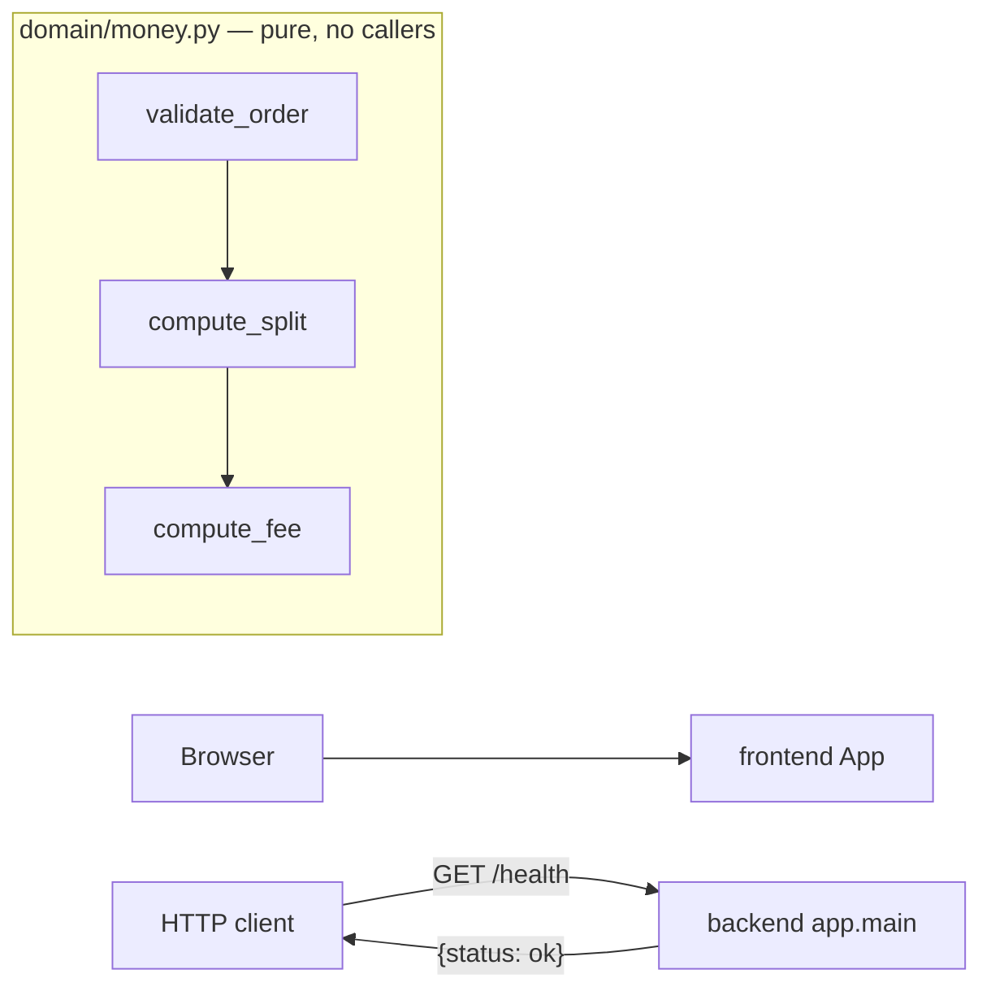

_Last updated: 2026-10-05 — T1: pure domain/money.py, not connected to the HTTP app._

# System overview

What is running after T1. `domain/money.py` exists and is pure. Nothing in the HTTP app calls it. Later pieces described in `docs/architecture.md` (database, services, auth, catalog, orders, payments) are not in the code yet.

## Legend

- **frontend App** — Vite + React + TypeScript. `src/main.tsx` mounts `src/App.tsx`, which renders the heading "Cerbo supplement ordering". No fetch client and no call to the backend.
- **backend app.main** — FastAPI app (`title="Cerbo supplement ordering"`) with one route: `GET /health` → `health()`, which returns `{"status": "ok"}`. It does not import `domain/money.py`.
- **HTTP client** — anything that calls the API. The only caller in the repo is `backend/tests/test_health.py` via `TestClient`. The frontend is not a client of this route.
- **domain/money.py** — pure Python in `backend/app/domain/money.py`. Imports only `collections.abc` and `dataclasses`. `validate_order` calls `compute_split`, which calls `compute_fee`. Types: `LineInput`, `LineSplit`, `OrderSplit`, `PricingError`. `FEE_BPS_DEFAULT = 75`. No edge to `app.main`: no route calls it. `backend/tests/test_money.py` exercises it and is not a runtime component.
- **Not in the diagram** — no database, services, auth, catalog, orders, or payment. SQLAlchemy, Pydantic, and Hypothesis are declared dependencies. Hypothesis is used by the money tests; the others are unused by application code.
