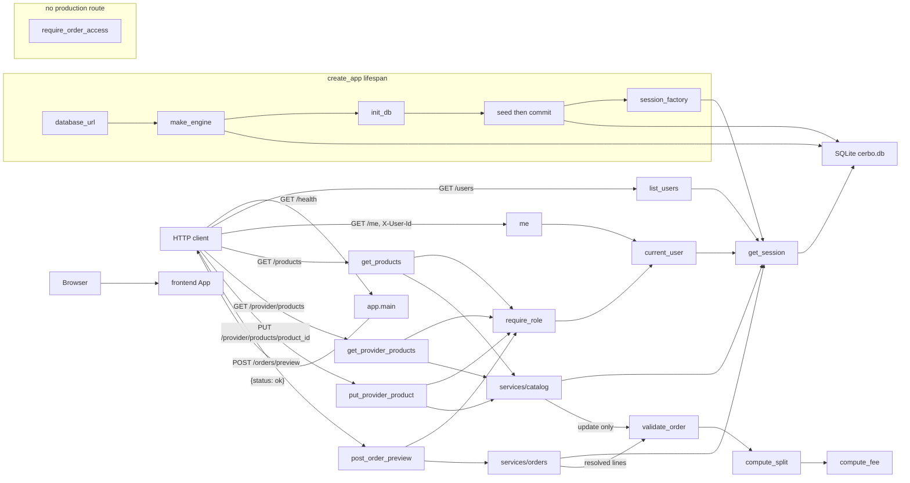

_Last updated: 2026-10-05 — T5: POST /orders/preview prices enabled lines and does not write._

# System overview

What is running after T5. `create_app` opens SQLite on startup, creates the six tables, seeds and commits, and serves `GET /health`, `GET /users`, `GET /me`, `GET /products`, `GET /provider/products`, `PUT /provider/products/{product_id}`, and `POST /orders/preview`. `update_provider_product` and `preview_order` both call `validate_order`. Preview does not write.

## Legend

- **frontend App** — Vite + React + TypeScript. `src/main.tsx` mounts `src/App.tsx`, which renders the heading "Cerbo supplement ordering". It has no fetch client and does not call the backend.
- **app.main** — `create_app` builds a FastAPI app (`title="Cerbo supplement ordering"`). `GET /health` → `health()` returns `{"status": "ok"}` with no auth and no database read. The app includes `api/users`, `api/catalog`, and `api/orders`. Three handlers share the error envelope `{"error": {"code", "message", "line_index"}}`: `APIError` (status from the error), `PricingError` (422, `message` is `detail`), and `RequestValidationError` (422 `VALIDATION_ERROR`, message "Invalid request", `line_index` null).
- **HTTP client** — anything that calls the API. Callers in the repo are pytest `TestClient` tests. The frontend is not a client of these routes.
- **list_users** — `GET /users` has no auth. It opens a session and returns every `users` row as `[{id, name, role}]`, ordered by `id`.
- **me / current_user** — `GET /me` depends on `seams/auth.current_user`, which reads header `X-User-Id` and loads `users` by id. A resolved user is returned as `{id, name, role}`. A missing header, a blank header, a non-ASCII-digit header, an id above the signed 64-bit maximum, or an unknown id becomes 401 `UNAUTHENTICATED`. See `flows/auth.md`.
- **require_role** — depends on `current_user`. A role outside the allowed set raises 403 `FORBIDDEN` "Wrong role". `GET /products` allows `provider` and `admin`. `GET /provider/products`, `PUT /provider/products/{product_id}`, and `POST /orders/preview` allow `provider` only.
- **services/catalog** — `list_products` reads `products` ordered by `id`. `list_provider_products` joins that provider's `provider_products` rows to `products`. `update_provider_product` loads one `products` row, calls `validate_order` with one line at quantity 1 and `FEE_BPS_DEFAULT`, then upserts only that provider's `provider_products` row (`enabled`, `default_price_cents`) and commits. Stock stays on `products`. See `flows/provider-products.md`.
- **services/orders** — `preview_order` does not commit and does not insert, update, or delete. For each request line, in order, it loads `provider_products` for `(provider_id, product_id)` and requires `enabled = 1`, then reads `products.unit_cogs_cents`. A `product_id` outside `1..9223372036854775807`, a missing provider row, `enabled = 0`, or a missing product raises `ProductUnavailable`. If earlier lines already resolved, it calls `validate_order` on that prefix first, so an earlier `PricingError` wins. When every line resolves, it returns `validate_order` of the full list at `FEE_BPS_DEFAULT`. It does not read `stock_qty`. The route maps `ProductUnavailable` to 422 `PRODUCT_UNAVAILABLE` with `line_index`. See `flows/order-preview.md`.
- **lifespan** — On startup, `make_engine(app.state.database_url)` opens SQLite (`check_same_thread=False`, `PRAGMA foreign_keys=ON`, `PRAGMA busy_timeout=5000`, `BEGIN IMMEDIATE` on begin). `init_db` runs `create_all`. `seed()` stages missing rows and the lifespan commits. `make_session_factory` is stored on `app.state.session_factory`. Shutdown calls `engine.dispose()`. The default URL is `sqlite:///./cerbo.db` from `app.config`; `create_app(database_url=...)` can override it.
- **get_session** — request dependency. It opens a `Session` from `app.state.session_factory` and closes it without committing. Catalog writes commit inside `update_provider_product`. `preview_order` only reads through that session.
- **SQLite cerbo.db** — the six STRICT tables in `app.models`: `users`, `products`, `provider_products`, `orders`, `order_lines`, `ledger_entries`. Startup seed commits the four users (Dr. Maya Patel, Jane Doe, Sam Lee, Cerbo Admin), products MAG-GLY, D3-K2, OMEGA3, and PROBIO50, and Dr. Patel's four enabled `provider_products`. It leaves `orders`, `order_lines`, and `ledger_entries` empty. See `data-model.md`.
- **require_order_access** — returns `None` when `user.id` is the order's `provider_id` or `patient_id`. Otherwise it raises 404 `NOT_FOUND` "Not found". No production route calls it.
- **validate_order** — `domain/money.py`. A provider-product update calls it with one `LineInput` (`qty` 1, the submitted price, the product's `unit_cogs_cents`) and `FEE_BPS_DEFAULT`. `preview_order` calls it with the resolved lines, also at `FEE_BPS_DEFAULT`, including a prefix when a later line is unavailable. It calls `compute_split`, which calls `compute_fee`. A `PricingError` becomes HTTP 422 and does not write.
- **Not drawn** — order creation, payment, cancel, patient orders, the provider dashboard, audit, and admin product routes are absent. Tests are not a runtime component.
