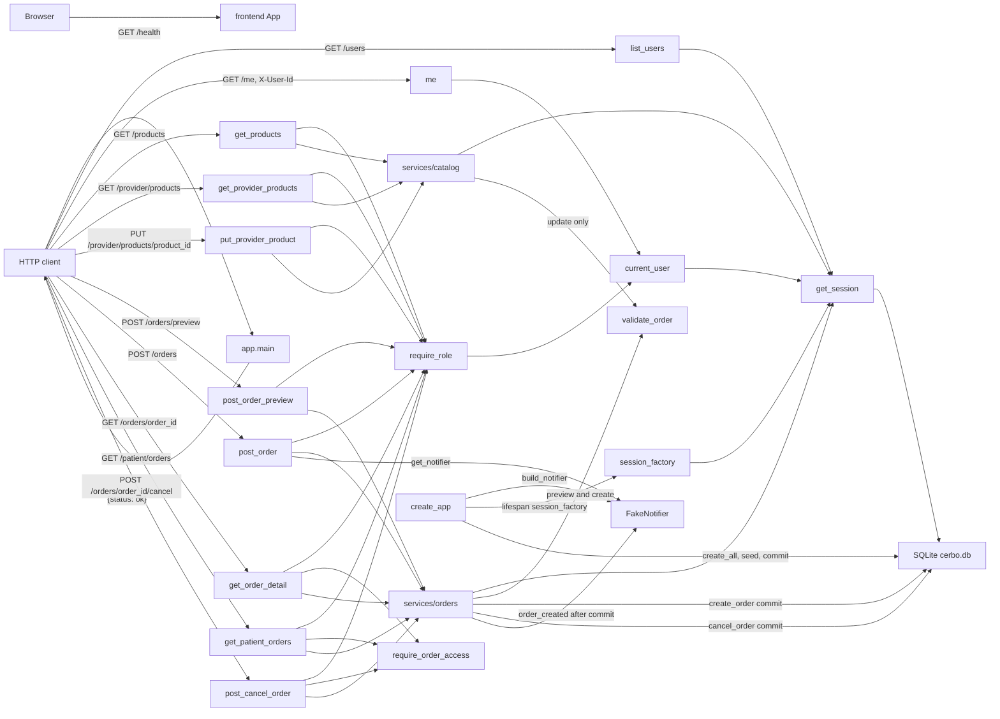

_Last updated: 2026-10-05 — T6: create, view, and cancel orders; FakeNotifier after commit._

# System overview

What is running after T6. `create_app` stores `config.build_notifier()` on `app.state.notifier`, then the lifespan opens SQLite, creates the six tables, seeds, and commits. The app serves `GET /health`, `GET /users`, `GET /me`, `GET /products`, `GET /provider/products`, `PUT /provider/products/{product_id}`, `POST /orders/preview`, `POST /orders`, `GET /orders/{order_id}`, `GET /patient/orders`, and `POST /orders/{order_id}/cancel`. Preview does not write. Create inserts `orders` and `order_lines` and then notifies. Cancel updates a `pending_payment` order. See `flows/orders.md`.

## Legend

- **frontend App** — Vite + React + TypeScript. `src/main.tsx` mounts `src/App.tsx`, which renders the heading "Cerbo supplement ordering". It has no fetch client and does not call the backend.
- **app.main** — `create_app` builds a FastAPI app (`title="Cerbo supplement ordering"`). `GET /health` → `health()` returns `{"status": "ok"}` with no auth and no database read. The app includes `api/users`, `api/catalog`, and `api/orders`. Three handlers share the error envelope `{"error": {"code", "message", "line_index"}}`: `APIError` (status from the error), `PricingError` (422, `message` is `detail`), and `RequestValidationError` (422 `VALIDATION_ERROR`, message "Invalid request", `line_index` null).
- **HTTP client** — anything that calls the API. Callers in the repo are pytest `TestClient` tests. The frontend is not a client of these routes.
- **list_users** — `GET /users` has no auth. It opens a session and returns every `users` row as `[{id, name, role}]`, ordered by `id`.
- **me / current_user** — `GET /me` depends on `seams/auth.current_user`, which reads header `X-User-Id` and loads `users` by id. A resolved user is returned as `{id, name, role}`. A missing header, a blank header, a non-ASCII-digit header, an id above the signed 64-bit maximum, or an unknown id becomes 401 `UNAUTHENTICATED`. See `flows/auth.md`.
- **require_role** — depends on `current_user`. A role outside the allowed set raises 403 `FORBIDDEN` "Wrong role". `GET /products` allows `provider` and `admin`. `GET /provider/products`, `PUT /provider/products/{product_id}`, `POST /orders/preview`, `POST /orders`, and `POST /orders/{order_id}/cancel` allow `provider` only. `GET /orders/{order_id}` allows `provider` and `patient`. `GET /patient/orders` allows `patient` only.
- **services/catalog** — `list_products` reads `products` ordered by `id`. `list_provider_products` joins that provider's `provider_products` rows to `products`. `update_provider_product` loads one `products` row, calls `validate_order` with one line at quantity 1 and `FEE_BPS_DEFAULT`, then upserts only that provider's `provider_products` row (`enabled`, `default_price_cents`) and commits. Stock stays on `products`. See `flows/provider-products.md`.
- **services/orders** — `preview_order` does not commit and does not insert, update, or delete. `create_order` checks the patient, calls `preview_order`, copies the snapshot onto a new `orders` row and `order_lines`, commits once, then calls `notifier.order_created`. `get_order`, `list_patient_orders`, and `present_order` read stored rows. `cancel_order` sets `cancelled` only from `pending_payment`. Neither create nor cancel changes `products.stock_qty` or inserts `ledger_entries`. See `flows/order-preview.md` and `flows/orders.md`.
- **create_app** — Calls `build_notifier()` and stores that `FakeNotifier` on `app.state.notifier` before the lifespan. `build_notifier` in `app.config` is the only place `FakeNotifier` is constructed. The lifespan still runs `make_engine`, `init_db` (`create_all`), `seed`, `commit`, and `make_session_factory`. Shutdown calls `engine.dispose()`. The default URL is `sqlite:///./cerbo.db`. `validate_order` still calls `compute_split`, which calls `compute_fee`; that chain is drawn in `flows/order-preview.md`.
- **FakeNotifier** — `seams/notifier.py`. `order_created` prints `order created: {patient_link}` and appends `(order.id, patient_link)` to `calls`. `post_order` reads the app instance through `get_notifier` on each request and passes it to `create_order`. The call happens only after the order commit. A notifier exception is logged; the created order is still returned. Preview, get, list, and cancel do not call it.
- **get_session** — request dependency. It opens a `Session` from `app.state.session_factory` and closes it without committing. `update_provider_product`, `create_order`, and `cancel_order` commit inside the service. `preview_order` and the order reads only use the session.
- **SQLite cerbo.db** — the six STRICT tables in `app.models`: `users`, `products`, `provider_products`, `orders`, `order_lines`, `ledger_entries`. Startup seed commits the four users (Dr. Maya Patel, Jane Doe, Sam Lee, Cerbo Admin), products MAG-GLY, D3-K2, OMEGA3, and PROBIO50, and Dr. Patel's four enabled `provider_products`. Seed leaves `orders`, `order_lines`, and `ledger_entries` empty. `create_order` later inserts `orders` and `order_lines`. `ledger_entries` stays empty. See `data-model.md`.
- **require_order_access** — returns `None` when `user.id` is the order's `provider_id` or `patient_id`. Otherwise it raises 404 `NOT_FOUND` "Not found". `GET /orders/{order_id}` and `POST /orders/{order_id}/cancel` call it after loading the order. `GET /patient/orders` calls it for each listed row. A missing order is 404 from `get_order` before this check. `POST /orders` and `POST /orders/preview` do not call it.
- **validate_order** — `domain/money.py`. A provider-product update calls it with one `LineInput` (`qty` 1, the submitted price, the product's `unit_cogs_cents`) and `FEE_BPS_DEFAULT`. `preview_order` calls it the same way, including a prefix when a later line is unavailable. `create_order` reaches it only through `preview_order`. A `PricingError` becomes HTTP 422. On create, that happens before any insert.
- **Not drawn** — payment, ledger writes, fulfillment, the provider dashboard, audit, and admin product routes are absent. `present_order` uses `line_amounts` on the stored line; that read path is in `flows/orders.md`. Tests are not a runtime component.
